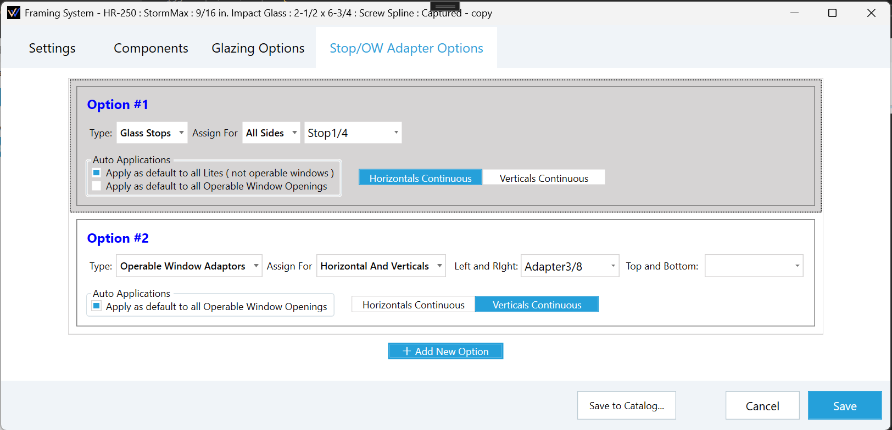
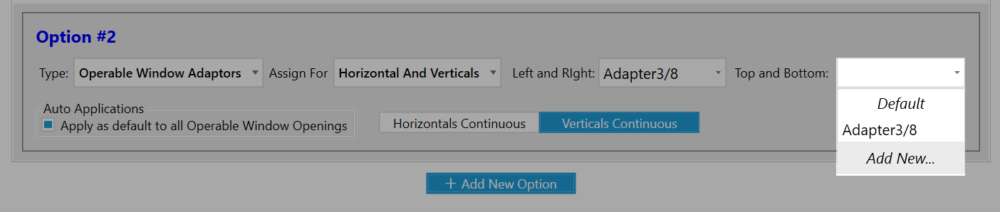
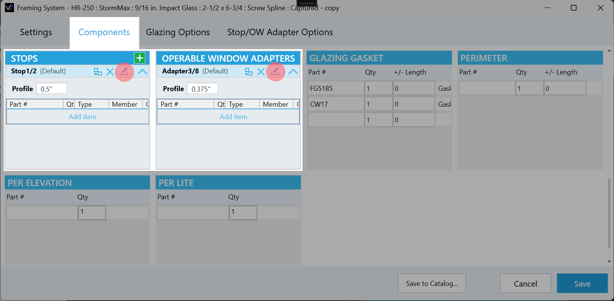

In **v16.10.4** we updated how stops are configured on a system in order to build out a tool tab that can add stops and operable window adapters to user selected openings.

:::danger Dev Note:
**Adapters** here refer to operable window adapters (vents) and exist to fill the need to track operable window parts.
**Glass Adapters** are more completely handled in the **Glazing Options** tool tab. 
:::

### Stop/OW Adapter Options Tab
A tab added to handle and configure stop and vent adapters options that can be applied automatically or manually to appropriate openings.

- **Option#** - A customizable name appearing in the editor while using the Stop/Adapter tool tab.
- **Type:** - Determines which component list to use.
    - **Stops** - Can be applied to any opening.
    - **Operable Window Adapters** - Can only be applied to operable windows.
- **Assign For** - Options to cover complex part assignment needs.
    - **All Sides** - The same assembly used for all sides.
    - **Horizontals and Verticals** - The Left and Right share an assembly assignment and the top and bottom share one.
    - **Each Side** - Each side gets assigned an assembly independently.
- **Auto Applications** - If checked the option will be applied to all opening using this system.
    - Apply as default to all Lites ( not operable windows ). 
    - Apply as default to all Operable Window Openings ( not operable windows ). 
- **Horizontals/Verticals Continuous** - Choose which sides should run the full length of the opening and which ones will be cut.
- **+ Add New Option** - Click to add additional option variations that you might apply specifically.

### Assembly Dropdown
The assembly dropdown is where you select the assembly to apply for this option.
- ***Default*** - Leaves the assembly blank.
- **The Assemblies** - Lists the relevant assemblies from the **Components** tab.
- ***Add New...*** - Opens up a view to add a new assembly for the selected type.

#### Adding a new assembly 
After adding an assembly if you want to edit it further that can be done in the **Components** tab.

[Click here](../tool-tabs/stopadapter) to learn about using the Stop/Adapter tool tab.

