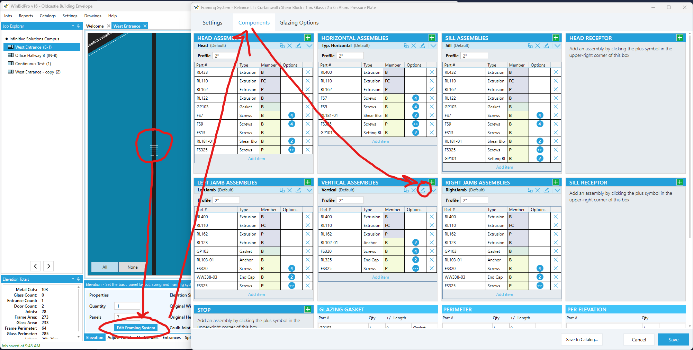
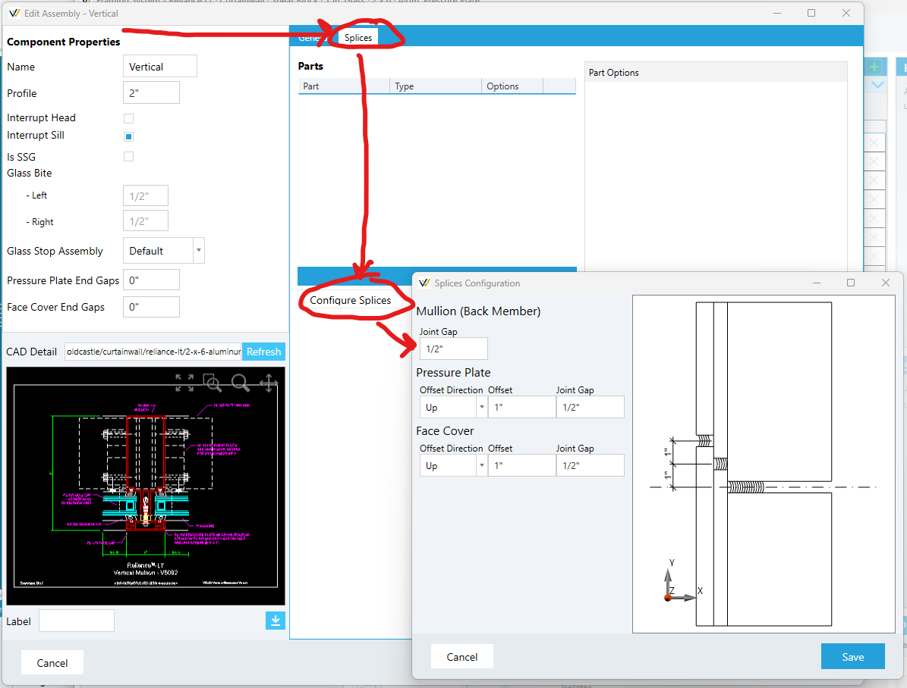
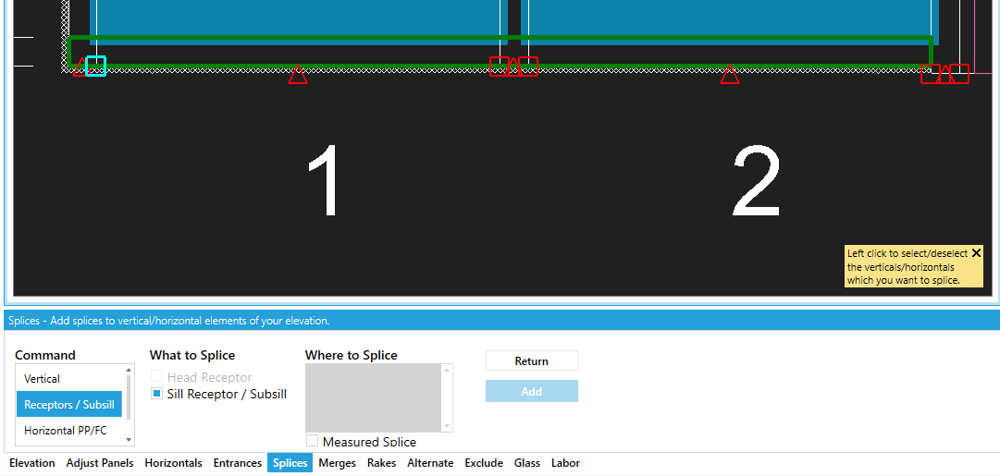

# Configuring Splices

You can configure splice gaps (and offsets for pressure plate and face covers) by editing the assembly and going to the splice tab. See the following images for how to get to the configuration view:

## Splice subsill/head receptors

Head receptors, flashing, and other subsills can be spliced with adjustable gaps and hardware.

> **Note:** The `Receptors / Subsill` subcommand describe below will only appear if your framing system is configured with a head or sill receptors.

### Steps:
1. Select the `Splice` tool tab at the bottom of the editor
1. Clicking `Add`
1. Under **"Command"** select the `Receptors / Subsill` subcommand
1. Under **"What to Splice"** check/uncheck the `Head Receptor` and `Sill Receptor` checkboxes as appropriate
1. Select or enter your snap points
    1. To splice at a snap point (midpoint or edge of a panel or vertical), click one of the red squares (endpoint) or triangles (midpoints) that appeared on the head or sill.
    1. To splice at manual distance from the left edge of the elevation, check the box that says "measured splice" under the splice locations list area and enter the X value you want to splice at.
1. Click `Add` to finish and apply the command

Multiple splice points may be selected when using snap points.

## Vertical

### Steps:
1. Select the `Splice` tool tab at the bottom of the editor
1. Clicking `Add`
1. Be sure the `Vertical` subcommand is selected
1. Select the verticals you want to splice (for more, see the note below)
1. Under **"Position"** enter the Y coordinate from the bottom of the elevation where you want to splice your verticals
1. Click `Add` to finish and apply the command

> ### Note about selecting verticals:
> There are many ways to adjust the vertical selection.
> 1. By default, all verticals are selected
> 1. You can enter comma-separted vertical numbers in the tool tab
> 1. Use the `All` and `None` buttons in the bottom left of the drawing to help reset the selection set
> 1. Click on individual verticals on the drawing to toggle their selection

## Pressure Plate and Cover

### Steps:
1. Select the `Splice` tool tab at the bottom of the editor
1. Clicking `Add`
1. Under **"Command"** select the `Horizontal PP/FC` subcommand
1. Select or enter your snap points
    1. To splice at a snap point (midpoint or edge of a panel or vertical), click one of the red squares (endpoint) or triangles (midpoints) that appeared on the head or sill.
    1. To splice at manual distance from the left edge of the elevation, check the box that says "measured splice" under the splice locations list area and enter the X value you want to splice at.
1. Click `Add` to finish and apply the command

