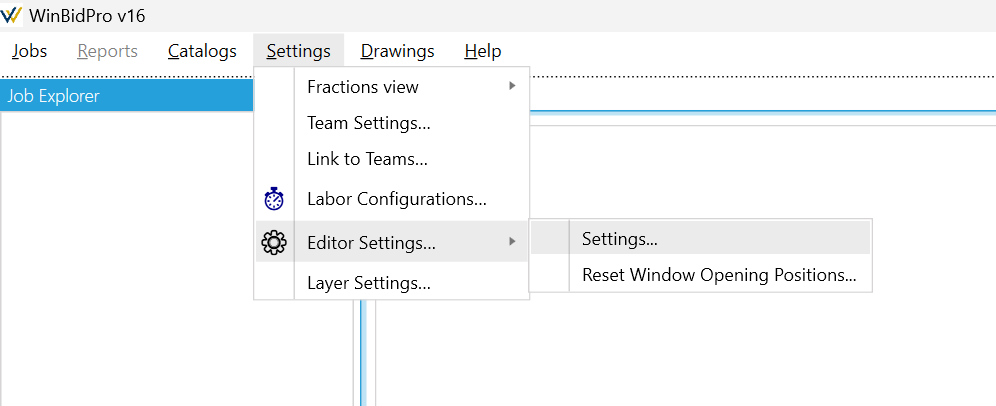

Features nearing completion may be released early to garner user feedback before the full release. It's advisable to create a copy of your job before using any commands in the tool tab labeled "Beta" in case of any breaking changes made to the beta feature.

1. In the menu under **Settings** open **Editor Settings**
    

2. Click the tab labeled **"Beta"**. Check the box to enable the beta feature and click **Save**.
    
