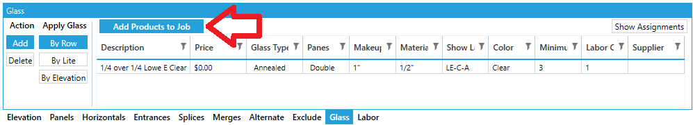
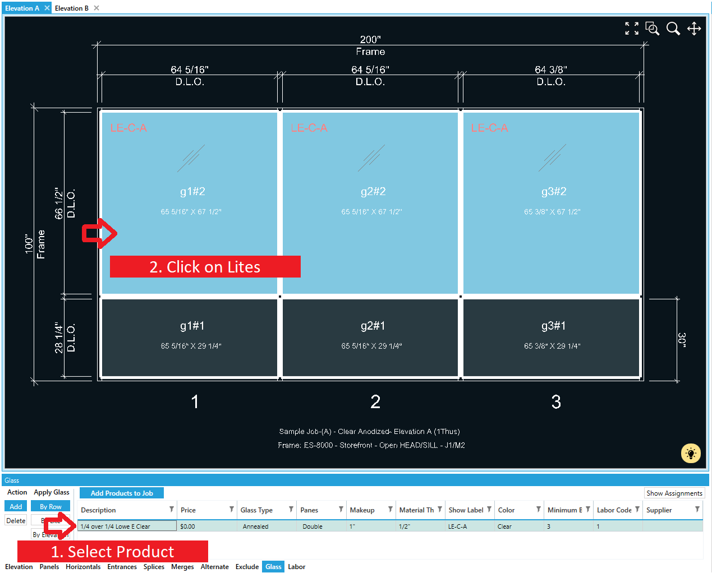

If you worked with version 15, the glass tab will feel familiar. The biggest change is in how we select glass.

### Step 1 - Add Glass to the Job

Click the "Add Products to Job" button to find glass products you wish to use in this job.

### Step 2 - Assign Glass

Select a product in the glass tab grid. Be sure "Add" is selected to the left of the grid. Then Click a lite of glass.

