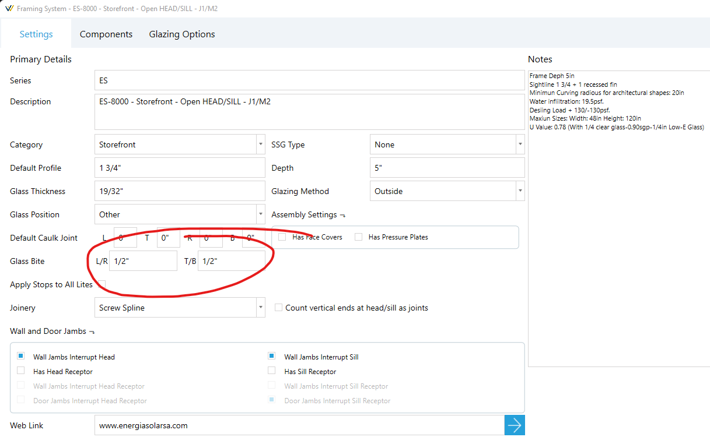
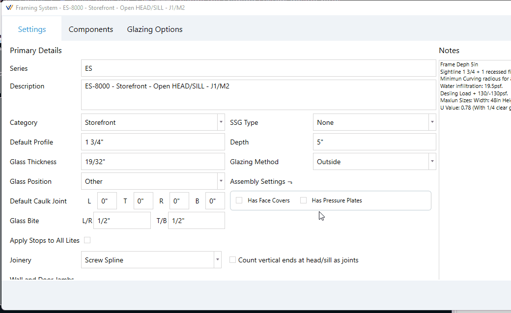

WinBidPro v16 allows finer control over glass bites than in v15. You can apply a default glass bite to your framing system, and then apply specfic bites to individual assemblies.

## Change the Framing System Default Bites

1. Click `Edit Framing System` in the `Elevation` tool tab.
2. Find the `Glass Bite` fields seen in the image below.

> L/R are the left and right bites.
> T/B are the top and bottom bites.

## Change the Bite(s) of Individual Assemblies

