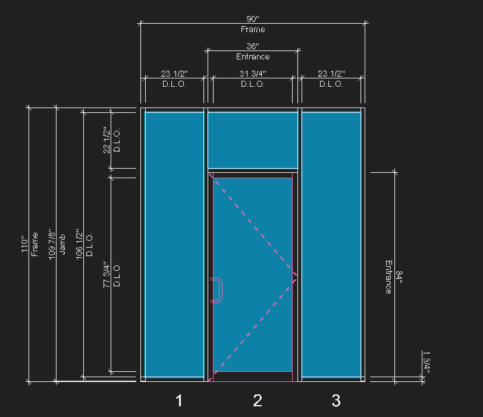
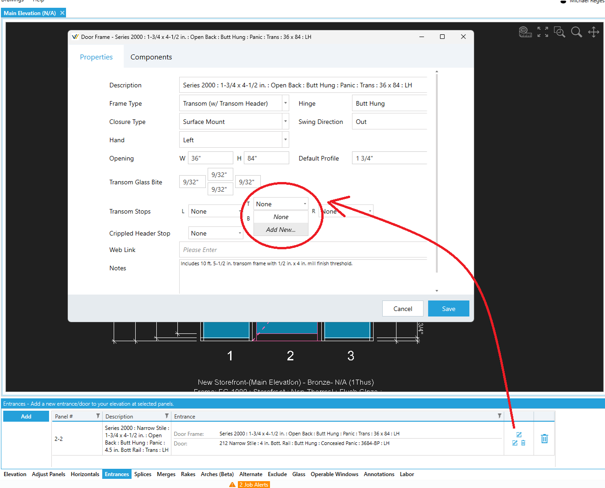
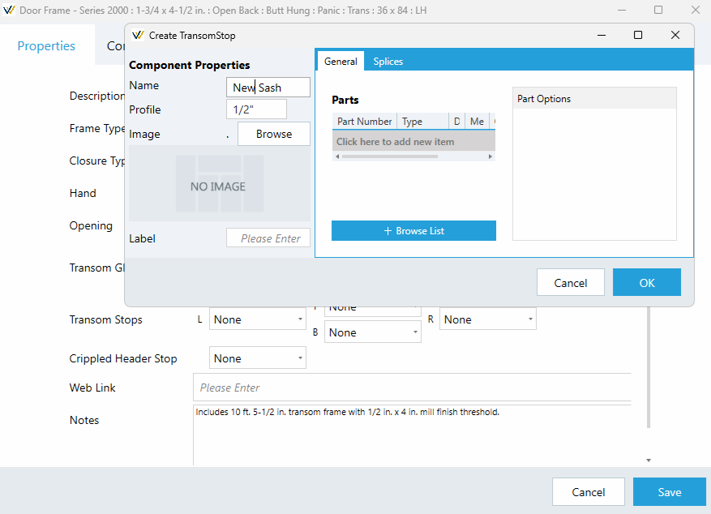
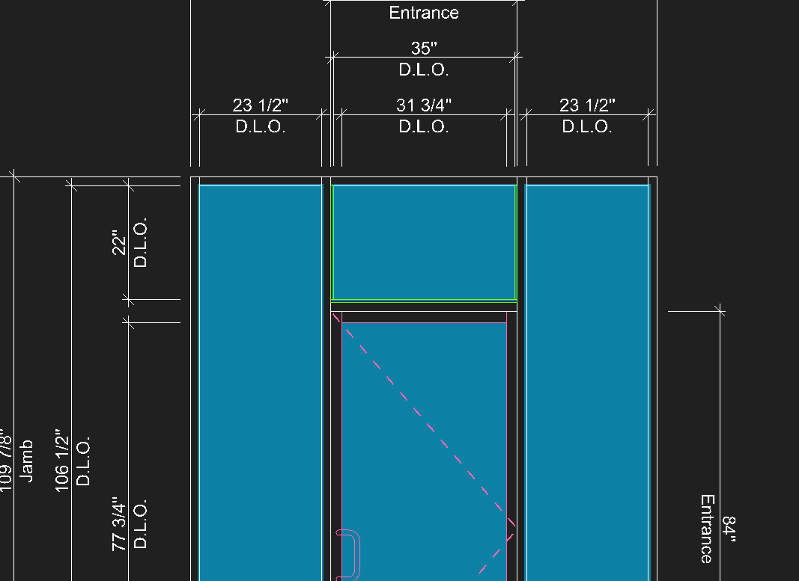

Entrances which require transom stops/sash can have these settings configured via the Door Frame editor. You can access this view from the Entrances tooltab, as shown in the steps below:

## Adding Transom Stop Components to an Entrance Configuration

1. In the example below, the entrance needs sash applied to the door jambs and door header of the transom opening.

2. Switch to the `Entrances` tooltab and open the `Door Frame` editor view.

3. Next to `Transom Stops`, you can open any of the drop down menus and click `Add New` to create a new transom stop configuration, which can then also be applied to any of the other sides.

4. Once you've created and applied the transom stop configurations for your entrance, click `Save` to apply them to the elevation drawing.

