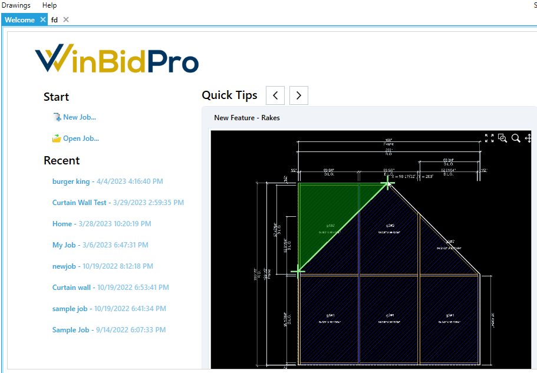

# Getting Started

## Installing WinBidPro v16
After downloading v16, you want to open the installation file and the program will install on your computer. A "W" WinBidPro v16 icon will be added to your desktop and the program will open automatically when the installer is finished.

WinBidPro v16 is a hybrid Cloud based system, so the program is installed on your computer, but all of the data used for quotes and drawings is stored in the Cloud on Amazon AWS servers. This means you can install the software on any computer running Microsoft Windows 8 or newer, login with your email address and password, and you will have full access to your company's data.

Apple Mac users can run WinBidpro if they have Parallels (software that lets you run MS Windows on a Mac) and a copy of MS Windows installed.

## Choose Your Vendor Catalogs
The first time you open v16 you will be prompted to select the vendor catalog(s) you want to created estimates with. If you ever need to add more catalogs, or even remove one from your list, you can:
1. Click on the `Catalogs` menu
2. Then click `Manage Vendors`

Whenever you create a new job you will select a catalog. There is only one list of jobs to look at. This will show you all of the jobs from any vendor created by any user in your company account.

## Welcome Tab 
The Welcome tab is a great place to see tips and new features about the program. You can also see a list of recent jobs, and create a new job, and open your list of jobs -- all from this one place.

## Know Your Catalogs
We always recommend that you familiarize yourself with the vendor catalog you will use to create jobs. Most catalogs available in v16 have list pricing already configured. A discount multiplier of 1 is set to all parts by default, so it is up to you to enter your company's multipliers for a certain vendor. There is a tool in the Final Parts View and the Edit Job Parts window to change multipliers for a job. The Vendor Parts window (under the Catalog - Parts menu) has the same tool to change multiples at the master catalog level.

Aside from know the pricing in a catalog, it is important to know a frame configuration when you intend to use it in a job. Each frame in the Framing Systems list is configured with all things that make for a accurate drawing and an complete list of parts. Before creating a job, it is always a good idea to edit the Framing System(s) you plan to use, and review how it is configured, and what parts are being used.

Version 16 makes this easier, because each frame component has all of it's required parts listed in as an Assembly. These Assemblies are all visible in the Components tab when editing a Framing System.

If you plan on using a different header part, for example, you can delete and add a different part number right from this screen. You can also edit an Assembly to add an remove parts. If you are editing a default frame in a catalog you will be prompted to make a copy of that frame, so the default will remain unchanged (this feature is coming soon, right now you will need to copy the frame first then edit).

## Create a New Job
To create a new job you can:
1. Click on the `Jobs` > `New Job` menu, or from the Jobs List window, click the + sign at the top left
2. Select the Vendor to use fom the list
3. Enter a name for the job
4. Select a Finish color for the job
5. Click the `Create` button

Next, you will start creating elevations. A New Elevation window will appear. Here you can either enter a Standard Elevation (default) or a Punched Entrance. Here is what you will do for a Standard Elevation:
1. Enter a name for your elevation
2. Edit the Code if you would like to match an elevation code from the plans your are taking off
3. Select a Framing System for this elevation by clicking the `Browse` button
4. Click `Save` to continue to the drawing window

Now you will need to define the basic layout of your elevation. Enter the quantity for this particular elevation, then the number of panels, then the overall width and height. Keep in mind if you are adding an entrance, and it has divided glass in the transom, you will need to count each division as a panel. For example, a transom entrance with glass divided down the middle requires 2 panels. When adding an entrance in this case, you would click on the two panels where the entrance will go, then select the entrance package to apply.

You now have the basic layout of your elevation. From this point, you can add horizontals, entrances, change panel widths and heights, among other things. Look for more documentation and training videos on these different drawing tools in the program.