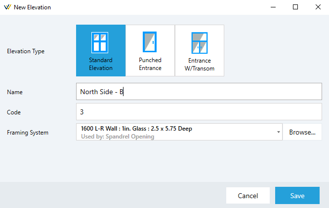

# Getting Started

## Choose Your Vendor Catalogs
Before creating estimates (Jobs) in v16, you will need to select the catalogs you would like to use. Since this software uses web-hosted data, there is no need to install catalogs, it is simply a matter of selecting the ones you want.
The first time you use v16, you will be prompted to selected catalogs, but if you need to add more later, you can:
1. Click on the `Catalogs` menu
2. Then click `Manage Vendors`

You can select the catalog to use when you create a new job. The jobs list will show you all of your jobs from any vendor.

## Know Your Catalogs
We always recommend that you familiarize yourself with the vendor catalog you will use to create jobs. Most catalogs available in v16 have list pricing already configured. A discount multiplier of 1 is set to all parts by default, so it is up to you to enter your company's multipliers for a certain vendor. As of July, 2022, we are working on adding a tool to make backup changes to multipliers in both the Parts List and the Final Parts report.

Aside from know the pricing in a catalog, it is important to know a frame configuration when you intend to use it in a job. Each frame in the Framing Systems list is configured with all things that make for a accurate drawing and an complete list of parts. Before creating a job, it is always a good idea to edit the Framing System(s) you plan to use, and review how it is configured, and what parts are being used.

Version 16 makes this easier, because each frame component has all of it's required parts listed in as an Assembly. These Assemblies are all visible in the Components tab when editing a Framing System.

If you plan on using a different header part, for example, you can delete and add a different part number right from this screen. You can also edit an Assembly to add an remove parts. If you are editing a default frame in a catalog you will be prompted to make a copy of that frame, so the default will remain unchanged (this feature is coming soon, right now you will need to copy the frame first then edit).

## Create a New Job
To create a new job you can:
1. Click on the `Jobs` > `New Job` menu, or from the Jobs List window, click the + sign at the top left
2. Select the Vendor to use fom the list
3. Enter a name for the job
4. Select a Finish color for the job
5. Click the `Create` button

Next, you will start creating elevations. A New Elevation window will appear. Here you can either enter a Standard Elevation (default) or a Punched Entrance. Here is what you will do for a Standard Elevation:
1. Enter a name for your elevation
2. Edit the Code if you would like to match an elevation code from the plans your are taking off
3. Select a Framing System for this elevation by clicking the `Browse` button
4. Click `Save` to continue to the drawing window

Now you will need to define the basic layout of your elevation. Enter the quantity for this particular elevation, then the number of panels, then the overall width and height. Keep in mind if you are adding an entrance, and it has divided glass in the transom, you will need to count each division as a panel. For example, a transom entrance with glass divided down the middle requires 2 panels. When adding an entrance in this case, you would click on the two panels where the entrance will go, then select the entrance package to apply.

You now have the basic layout of your elevation. From this point, you can add horizontals, entrances, change panel widths and heights, among other things. Look for more documentation and training videos on these different drawing tools in the program.