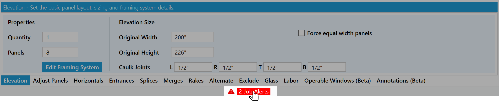
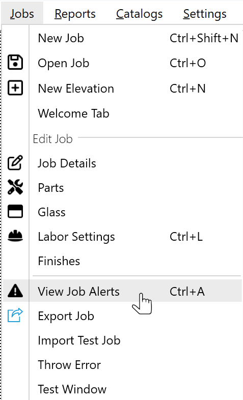
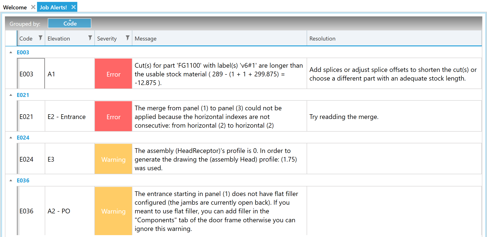
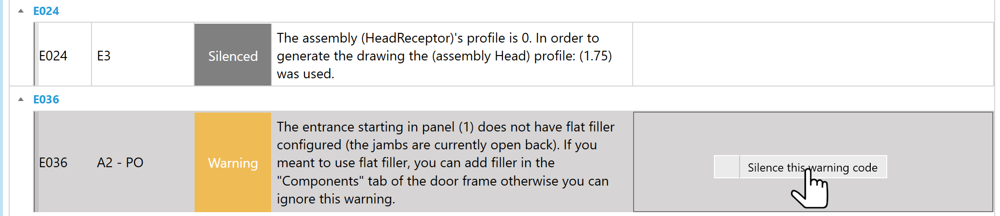

It can be hard to keep a so many details in your head and be sure that you checked everything. WinBidPro 16 can now help! WinBidPro 16 will perform various checks automatically and alert you to problems, or warn you about potential problems. It does this via the "Job Alerts" view. The kinds of things it can catch are:

* **Misconfigured parts.** In some scenarios we can see when you have entered a part in the wrong component or if the part has some wrong settings
* **Missing system components.** For instance, if you have glass next to an entrance, but there is no pocket filler configured for the door jamb, we'll give you a warning about it.
* **Issues with elevation commands.** For example, if you add an entrance and a later change to the elevation causes a conflict with the entrance.
* **And more!**

To navigate to the job alerts view click the **Job Alert Status** icon beneath the elevation tooltabs.

Or from the **Job** Menu.

## Column Head Definitions

**Code**: The unique identifier for this type of alert. 
**Elevation**: The name of the elevation that the alert occured in. If this is blank than the error is for a conflicting system setting. 
**Severity**: The current types of severity are Error or Warning. 
**Message**: A description with information on what caused the error. 
**Resolution**: Some steps or place to go to resolve the alert. 

## Silence a Warning

Warning are reminders or notes of peculiarity and you can silence them by right clicking a row.

Want an alert added for something? Send us suggestions at https://feedback.winbidpro.com/
