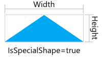

## Final Glass Exports

### Available Fields

> **NOTE:** Some of the following details may change as we continue to finalize the export format with our partners.

The final glass required for the job may be exported to a CSV format delimited by commas. We could also produce a newer export in JSON format for a richer set of fields and include information about the user and/or job if any party is interested in this.

The fields available are specified in the following table: 

| Field | Description | Exported | CSV Export Field (if different) |
|--------|---|---|---|
| `GlassId` | A unique product id 24-characters long | ❌ ||
| `Quantity`| The number of units required for the job. | ✅ ||
| `Description`| Purely descriptive. A user entered field. Not necessarily unique. | ✅ ||
| `Label`| A short label used to identify the product on drawings. A user entered field. | ✅ ||
| `Type`| Must be one of [`"Tempered"`, `"Annealed"`, `"Miscellaneous"`, `"Spandrel"`, `"Laminated"`, `"Heat Tempered"`] | ✅ ||
| `Thickness` | The overall thickness of the lite including spacers. Note: the program sometimes refers to it as "Makeup" | ✅ ||
| `Width` | The width of the lite of glass. If IsSpecialShape is 'TRUE', this is the width of a rectangular bounding box fit tightly around the upright lite of glass.  | ✅ ||
| `Height` | The height of the lite of glass. If IsSpecialShape is 'TRUE', this is the height of a rectangular bounding box fit tightly around the upright lite of glass. See the image included for `Width`.  | ✅ ||
| `BlockWidth` | The width in inches rounded up to the nearest even inch | ✅ | `Block Width` |
| `BlockHeight` | The height in inches rounded up to the nearest even inch  | ✅ | `Block Height` |
| `MinimumBlockArea`| The minimum block area charged for a glass product in square feet. This affects price only and does not limit the glass size. May be 0 | ✅ |
| `BlockArea` | The block area in square inches, **but exported to CSV in square feet**. Simply `BlockWidth * BlockHeight / 144` to get sqft  | ✅ | `Blk Area` |
| `IsSpecialShape` | `True` or `False`. True for any lites that are non-rectangular. NOTE: csv exports are typically upper case `TRUE` and `FALSE` values but it is best to be case insensitive. | ✅ | `Is Special Shape` |
| `PricePerSquareUnit` | Price of the product per square foot. The user typically enters this as provided by the supplier, but may be 0 if not entered. | ✅ | `Price / sqft`
| `BlockPrice` | The `BlockArea / 144 * PricePerSquareUnit` or `MinimumBlockArea * PricePerSquareUnit`, whichever is greater. | ❌ || 
| `TotalPriceByBlock` | The total price using Block area. `BlockPrice * Quantity` | ✅ | `Total Price (Block Area)` |
| `Supplier` | Purely descriptive, entered by the user. Has no impact on anything. May be empty/null. | ✅ | `Glass Supplier` |
| `Color` | Purely descriptive, entered by the user. No impact on price. It is sometimes used for filtering in WinBidPro | ✅ ||
| `Area` | The real area in square feet | ❌ ||
| `LitePoints` | An array of 3 or more `Point2D` coordinates that make the shape of the lite | ❌ ||

---
---
---

## Final Parts Export

### Available Fields

| Field | Description | Exported | CSV Export Field (if different) |
|--------|---|---|---|
| `UnitsNeeded` | The number of units, *not* packages, required for the job. This will be in a count or in feet depending on the `Handling` field. See the [Package and Unit Handling](#package-and-unit-handling) section below.| ✅ | `Units Needed` |
| `FullPartNumber` | A unique string including non-alphanumeric characters such has `-` or `/`. The user may change this by removing or adding non-alphanumeric characters only. Best for display but not lookups. (eg. `E9-1001/13`) | ✅ | `Display Part Number` |
| `PartNumber` | The base part number, stripped of non-alphanumeric characters. This is helpful for part lookups when manufacturers are inconsistent with the formatting. (eg. `E9100113`) | ✅ | `Part Number` |
| `FinishSuffix` | The suffix code, usually 2-4 characters, appended to the `PartNumber` or `DisplayPartNumber` to indicate the finish of the product. | ✅ | `Finish Suffix` |
| `FinishName` | The name of the finish. Note that users can rename finishes or add their own. Users may rename finishes within a WinBidPro catalog | ✅ | `Finish Name` |
| `Description` | The part description | ✅ ||
| `Type` | A short string to help filter or describe the use of the part at a glance. Purely descriptive and makes no change to how the part is handled/processed by WinBidPro (eg. `"Water Dam"`, `"Gasket"`, `"Extrusion"`, etc.) May be user defined. | ✅ | `Part Type`|
| `Handling` | Must be one of [`"Counted"`, `"Measured"`, `"Optimize"`]. See the [Package and Unit Handling](#package-and-unit-handling) section below. | ✅ ||
| `Length` | Length, in inches, for parts with `Measure` or `Optimize` handlings. For example, a 500' roll would be a value of 6000 (inches). May be a floating point number. For `Count` parts this will be 0 or null. (empty for csv exports). | ✅ ||
| `PackagesToOrder` | The number of packages required to fulfill the units needed. We always round up to whole packages. | ✅ | `Packages To Order`|
| `UnitsPerPackage` | An integer, always greater than 0. For `Count` and `Optimize` parts, this is the number of units per package. For example, users may enter it as a 4 pack of 24' stocks of aluminum--thus the value would be 4. For `Measure` parts, this is the number of Rolls or similar. For example, a user may purchase a 3 pack of 250' rolls of gasket at a discounted price | ✅ | `Units/Package`|
| `PackagePrice` | The base price per package of the part. Note: see also `Multiplier` | ✅ | `Package Price` |
| `UnitPrice` | Price per unit or foot of the part depending on the handling | ✅ | `Unit Price` | 
| `Multiplier` | Multipliers are used by manufacturers to offer discounts and also to raise base prices. Always greater than 0. Maybe be greater than 1. The real price is `PackagePrice * Multiplier`. | ✅ ||| `TotalUnitPrice` | The price if charged per unit, not per package. | ✅ | `Total (by Units)` |
| `TotalByPackage` | The price if purchasing whole packages when unit quantity is less than a package amount. | ✅| `Total (by Package)` |
| `TotalByUnit` | The price if purchasing whole packages when unit quantity is less than a package amount. | ✅| `Total (by Unit)` |
| `Weight` | Not required by WinBidPro, this can help users consider shipping costs. Will be 0 or greater. | ✅ | `Package Weight` |
| `TotalWeight` | The total weight calculated by `WeightPerPackage * PackagesToOrder` | ✅ | `Total Weight` |
| `howCreated` | Indicates how the line item was created. One of [`Generated`, `Modified`, `Added`]. `Generated` means WinBidPro determined the units needed. `Modified` means the user adjusted the units needed from what WinBidPro generated. `Added` means a user added the item themselves. | ✅ ||

## [Package and Unit Handling](#package-and-unit-handling)

The `Handling` field of  a part determines what type of units we are dealing with in the `UnitsNeeded` field. There are 3 possible handlings in WinBidPro

### 1. The `Count` Handling

`Count` parts are typically hardware parts such as screws or hinges, things you count and do not measure. The `UnitsNeeded` is a simple count of how many are needed. `PackagesToOrder` = `Ceiling(UnitsNeeded / UnitsPerPackage)`

> **Example**
>
> User needs 401 screws. They come in boxes of 200. In this case the data could be represented in JSON like `{ ... UnitsNeeded: 401, Length: 0, UnitsPerPackage: 200, PackagesToOrder: 3 ... }`. 

### 2. The `Measure` Handling
`Measure` parts have a length. For example gasket material sold in rolls of 500'. For these line items, the `UnitsNeeded` are in inches **(though our program displays them in feet)** and `PackagesToOrder` = `Ceiling(UnitsNeeded / (Length * UnitsPerPackage))`.

> **Example**
>
> User needs 751' of a gasket part. The part is sold in 250' rolls. Rolls are sold individually. In this case the data could be represented in JSON like `{ ... UnitsNeeded: 9012, Length: 3000, UnitsPerPackage: 1, PackagesToOrder: 4 ... }`.

### 3. The `Optimize` Handling
`Optimize` parts are treated like `Count` parts. The one difference is they have a length which is often displayed in inches to the user. For these parts, our optimizer has determined how many stocks to order so `UnitsNeeded` is again a simple count. `PackagesToOrder` = `Ceiling(UnitsNeeded / UnitsPerPackage)`

For these parts, `Length` tells us the length of stock to order. It's often ~24' but may be a custom length specified by the user for a custom order from the manufacturer.

> **Example**
>
> User needs 3 stocks of an extrusion. The part is sold in 24'1" stocks. The stocks are sold individually. In this case the data could be represented as JSON like `{ ... UnitsNeeded: 3, Length: 289, UnitsPerPackage: 1, PackagesToOrder: 3 ... }`.

