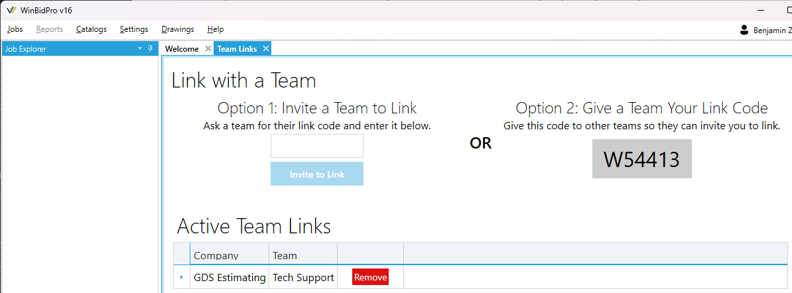
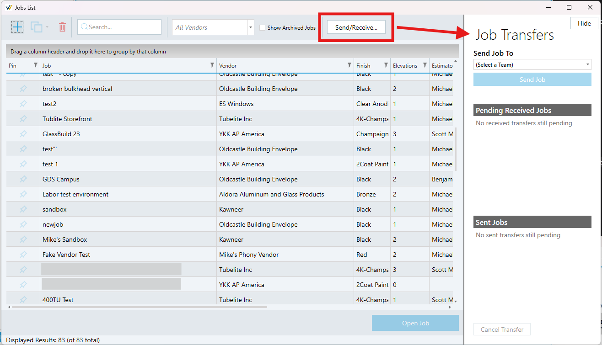

You can share jobs with other teams and companies that also use WinBidPro 16. You start by linking to the other team(s). Once linked, you'll be able to send and received jobs from the jobs list view. Once linked, you do not have to perform these steps again unless someone removes it.

## Linking to a Team

Go to `Settings > Team Links...`

A tab like below should open. You have two options

### Option 1 - Get a link code from the other team
1. Get the team code from someone on the other team and enter it into the field. Then click the `Invite to Link` button. You may need to call and ask for the code from an estimator on the team who has access to WinBidPro.
2. Once sent, someone on that team will need to accept it from this same Team Links view. It should appear instantly on their screen when you send the invite.
3. When they accept, you can now send/received jobs. See below for more on sending/receiving jobs.

### Option 2 - Give the other team your link code
1. Your link code is displayed in the gray box. In the example below, it is `W54413`. You can provide this code to anyone you wish to link with. They will then need to perform the steps for option 1 using the app with their own account.
2. When they enter your code and send the invite, it should immediately appear on this tab as an invitation to link. Press the `Accept` button.
3. You will now be able to send/recieve jobs. See below for more on sending/receiving jobs.

## Sending and Receiving Jobs

Sending and receiving jobs occurs from the Jobs list view. 

### Sending a job

1. Go to `Jobs > Open Job...`
4. Select (but don't open) a job from the job list by clicking it once.
2. Show the Job Transfers sidebar by clicking `Send/Receive...` at the top of the view (see the figure below).
3. Click the `Send Job To` dropdown and select the team you wish to share a job with.
5. Click `Send Job` to send a copy to the team. It will appear in the Sent Jobs list until it is accepted by a member of that team.

