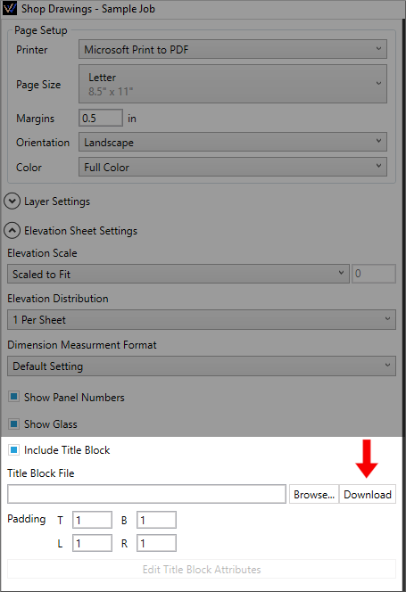
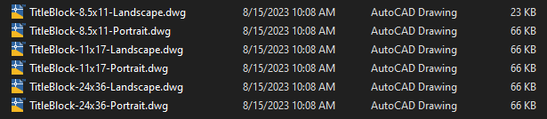
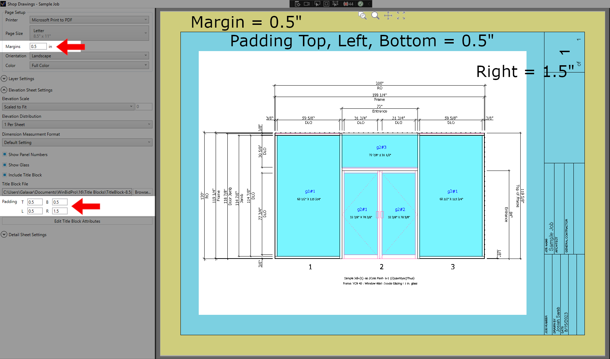
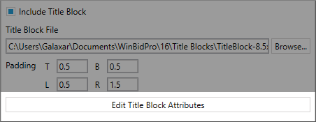
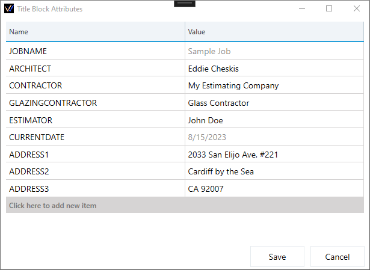
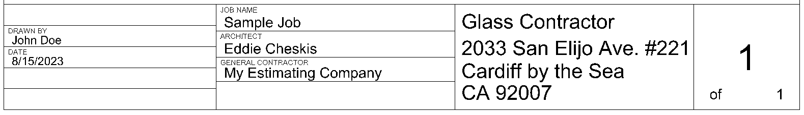

Including title blocks in your shop drawings are a powerful way to make your shop drawings look like they were prepared by a professional CAD shop, but with just a few easy clicks.

## Download WBP's Default Title Blocks
Clicking the download button will add default title blocks to: <br/> ```C:\Users\User\Documents\WinBidPro\16\Title Blocks```



## Browse... to Select Title Block

Click the ```Browse...``` button and select the Title Block DWG that fits your paper size and orientation. Or select one of your own.



## Margins & Padding

**Margins** are the same on all sides. Enter your margin as a decimal number in inches. Entering 0.5 means 1/2". Your Title Block will be placed in the bottom left corner of the page, just inside the margin. See yellow area of the image below.

**Padding** helps adjust for the space taken up by the title block and adding a little extra to pad the elevations from the border of the title block. See the blue space in the image below.




## Add/Edit Title Block Attributes

Attributes are text objects that get replaced whenever your title block is inserted into a drawing -- For instance, an attribute called "ARCHITECT" would be where the name of the architect would be placed when WinBidPro generates a shop drawing.

Click ```Edit Title Block Attributes``` to see and edit attributes found on the selected Title Block DWG



**Light Grey** values are automatically added to the title block. Adding an input will override the predefined value. 


**Black** values are inputs that were added by the user.




After clicking ```Save``` regenerate the drawing to see your added attributes.



## Predefined Attributes
**The following attributes will automatically be filled in by WinBidPro unless overriden in the ```Edit Title Block Attributes``` list.**

- JOBNAME
- ESTIMATOR
- CURRENTDATE
- TOTALSHEETS
- SHEETNUMBER

:::info MORE COMING
Attributes are saved to each job. In the future we will look at making attributes configurable at the Team level so you don't have to re-add certain attributes like ADDRESS1,2,3 on each job.
:::

## Creating a Title Block for WinBidPro

To create or modify a Title Block, you need to know a little about using a CAD program. We know how difficult CAD can be, but thankfully Title Blocks tend to be some of the easiest things to draw in CAD. Most of the time Title blocks can be drawn with just simple lines, text, and these things called Attribute Definitions (or just Attributes).

:::tip
If you don't know CAD, but want a truly profressional and unique Title Block, try finding a company or individual you can pay to make a profressional CAD logo and/or Title Block for you that you can use in WinBidPro.
:::

Alternatively, you can often search for free Title Blocks on Google search (or Google image search) to use for your purposes. You may also have CAD drawings from previous jobs that were done by a third-party professional CAD shop. You should check to be sure there are not legal restrictions preventing you from reusing such a Title Block before adjusting it for use in WinBidPro.

To get started with making a custom title block, we recommend starting with one of samples in the ```C:\Users\User\Documents\WinBidPro\16``` folder. This folder contains several sample Title Block files that you may edit in CAD. There are a few things to note about how Title Blocks are used before you get started:

### Things to Know About CAD

#### 1. Title blocks are made for specific page layouts
Title Blocks are inserted at the bottom left corner of the page, just inside the margins. See the image in Margins and Padding above.

:::info IMPORTANT
The bottom left corner of the title block drawing should start at the coordinate (0,0) to start just inside the margins on the bottom left of the page.
:::
:::tip
Make the title block the size of the page minus the margins of the page. For an 8.5" x 11" page in landscape orientation with 1/2" margins, your title block should be 10 units wide and 7.5 units tall. This allows 1/2" margin on each side.
:::

#### 2. Save your title blocks files as DXF 2013, DWG 2013
You must Save your title blocks files as DXF 2013, DWG 2013, or lower. Later versions of these file formats may not be supported yet.

#### 3. Title blocks can contain anything
Title blocks can contain anything including your comapany logo, the current date, and notes you want on every drawing. Logos can make a Title Block that much more professional looking.

#### 4. Not all features in modern CAD programs are supported
In particular, WinBidPro does not support multiline attributes that allow dynamically inserted text to flow onto another line when it runs out of space.