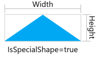

Here you'll find details about what's included in exports.

The following sections and tables below describe the fields provided in the combined JSON export of report data. There are also columns indicating whether the field is included in CSV exports and what the field name is, if different from the JSON one. We highly recommend the JSON report for importing over the CSV because it contains a richer set of data and relationships including data about the job.


### Example


    ```json
    {
        "description": "A generic export of all report data for a WinBidPro job for use in third-party software.",
        "reportVersion": "1.0",
        "app": "WinBidPro 16",
        "appVersion": "16.9.3.0",
        "job": "GDS Estimating - San Diego Campus",
        "isMetric": false,
        "createdAt": "2024-10-03T23:27:27.7334765Z",
        "jobId": "66fd5ee770508d4e0c7fda89",
        "parts": [], // see Final Parts Export below
        "glass": []  // see Final Glass Export below
    }
    ```


## [Final Glass Export](#final-glass-export)

### Available Fields

The glass required for the job may be exported to a CSV format delimited by commas or included in the `"glass":{}` field of the json report.

The fields available are specified in the following table: 

| Field | Description | Exported to CSV | CSV Export Field (if different) |
|--------|---|---|---|
| `ProductId` | A unique id to the product in WinBidPro's DB. | ❌ ||
| `Description`| A user entered description of the product. Note: It should be unique but WinBidPro does not currently validate the uniqueness within a job. | ✅ ||
| `Quantity`| The number of units required for the job. | ✅ ||
| `ProductLabel`| A short label used to identify the product on drawings. A user entered field. | ✅ ||
| `Type`| Must be one of [`"Tempered"`, `"Annealed"`, `"Miscellaneous"`, `"Spandrel"`, `"Laminated"`, `"Heat Tempered"`]. | ✅ ||
| `NumberOfPanes` | 1 for single, 2 for double glazed, 3 for triple. | ❌ ||
| `Thickness` | The overall thickness of the unit including insulating and laminating layers. Note: the program sometimes refers to it as "Makeup". | ✅ ||
| `GlassMaterialThickness` | Thickness of the lites only, not including insulating and laminating layers. Used to roughly estimate weight of the unit. For example 1/4 over 1/4 insulated unit of 1" thickness would have a value of 0.5 | ❌ ||
| `Width` | The width of the lite of glass. If IsSpecialShape is 'TRUE', this is the width of a rectangular bounding box fit tightly around the upright lite of glass. <br/> | ✅ ||
| `Height` | The height of the lite of glass. If IsSpecialShape is 'TRUE', this is the height of a rectangular bounding box fit tightly around the upright lite of glass. See the image included for `Width`.  | ✅ ||
| `BlockWidth` | The width in inches rounded up to the nearest even inch. | ✅ | `Block Width` |
| `BlockHeight` | The height in inches rounded up to the nearest even inch. | ✅ | `Block Height` |
| `Area` | The real area in sqft. | ❌ ||
| `BlockArea` | The block area in sqft. | ✅ | `Blk Area` |
| `MinimumBlockArea`| The minimum block area charged for a glass product in square feet. This affects price only and does not limit the glass size. May be 0. | ✅ |
| `IsRectangular` | `true` or `false`. False for any instances that are a custom shape. NOTE: csv exports flip this boolean with an 'Is Special Shape' header and values are upper case `TRUE` and `FALSE`, but it is best to be case insensitive. | ✅ | `Is Special Shape` |
| `PricePerSquareUnit` | Price of the product per square foot. The user typically enters this as provided by the supplier, but may be 0 if not entered. | ✅ | `Price / sqft`
| `TotalPriceByBlock` | The total price using Block area. `BlockPrice * Quantity` | ✅ | `Total Price (Block Area)` |
| `Supplier` | Purely descriptive, entered by the user. May be useful for grouping and ordering. May be empty/null. | ✅ | `Glass Supplier` |
| `Color` | Purely descriptive, entered by the user. No impact on price. It is sometimes used for filtering in WinBidPro | ✅ ||
| `Contour` | A base64 encoded DXF file of a precise drawing of the custom glass shape. This field will only be included if the IsRecatangular field is false. **NOTE: There is a lot of useless header data in these files currently. We plan to strip this file down to a more minimal template** | ❌ ||

### Example

```json
{
    "productId": "629694badc6c8148f89739dd",
    "description": "Evergreen / Clear - 1/4 / 1/4 Tempered",
    "quantity": 2,
    "productLabel": "EvCl-T",
    "type": "Tempered",
    "thickness": 0.5,
    "numberOfPanes": 2,
    "glassMaterialThickness": 0.5,
    "width": 10.5,
    "height": 64.0625,
    "blockWidth": 12.0,
    "blockHeight": 66.0,
    "area": 4.671875,
    "blockArea": 5.5,
    "minimumBlockArea": 3.0,
    "isRectangular": true,
    "pricePerSquareUnit": 0.0,
    "blockPrice": 0.00,
    "totalPriceByBlock": 0.00,
    "supplier": null,
    "color": "Green"
}
```

## [Final Parts Export](#final-parts-export)

The parts required for the job may be exported to a CSV format delimited by commas or included in the `"parts":{}` field of the json report.

### Available Fields


| Field | Description | Exported | CSV Export Field (if different) |
|--------|---|---|---|
| `UnitsNeeded` | The number of units, *not* packages, required for the job. This will be in a count or in feet depending on the `Handling` field. See the [Package and Unit Handling](#package-and-unit-handling) section below.| ✅ | `Units Needed` |
| `FullPartNumber` | A unique string including non-alphanumeric characters such has `-` or `/`. The user may change this by removing or adding non-alphanumeric characters only. Best for display but not lookups. (eg. `E9-1001/13`) | ✅ | `Display Part Number` |
| `PartNumber` | The base part number, stripped of non-alphanumeric characters. This is helpful for part lookups when manufacturers are inconsistent with the formatting. (eg. `E9100113`). **NOTE: for OBE this is their "Item #". We will be working out a solution soon to include their part #.** | ✅ | `Part Number` |
| `FinishSuffix` | The suffix code, usually but not limited to 1-4 characters, appended to the `PartNumber` or `DisplayPartNumber` to indicate the finish of the product. OBE also indicates custom stock lengths in a suffix.| ✅ | `Finish Suffix` |
| `FinishName` | The name of the finish. Note that users can rename finishes or add their own. | ✅ | `Finish Name` |
| `Description` | The part description | ✅ ||
| `Type` | A short string to help filter or describe the use of the part at a glance. Purely descriptive and makes no change to how the part is handled/processed by WinBidPro (eg. `"Water Dam"`, `"Gasket"`, `"Extrusion"`, etc.) May be user defined. | ✅ | `Part Type`|
| `Handling` | Must be one of [`"Count"`, `"Measure"`, `"Optimize"`]. See the [Package and Unit Handling](#package-and-unit-handling) section below. | ✅ ||
| `Length` | Length, in inches, for parts with `Measure` or `Optimize` handlings. For example, a 500' roll would be a value of 6000 (inches). May be a floating point number. For `Count` parts this will be 0 or null. (empty for csv exports). | ✅ ||
| `PackagesToOrder` | The number of packages required to fulfill the units needed. We always round up to whole packages. | ✅ | `Packages To Order`|
| `UnitsPerPackage` | An integer, always greater than 0. For `Count` and `Optimize` parts, this is the number of units per package. For example, users may enter it as a 4 pack of 24' stocks of aluminum--thus the value would be 4. For `Measure` parts, this is the number of Rolls or similar. For example, a user may purchase a 3 pack of 250' rolls of gasket at a discounted price | ✅ | `Units/Package`|
| `PackagePrice` | The base price per package of the part. Note: see also `Multiplier` | ✅ | `Package Price` |
| `UnitPrice` | Price per unit or foot of the part depending on the handling | ✅ | `Unit Price` | 
| `Multiplier` | Multipliers are used by manufacturers to offer discounts and also to raise base prices. Always greater than 0. Maybe be greater than 1. The real price is `PackagePrice * Multiplier`. | ✅ ||| `TotalUnitPrice` | The price if charged per unit, not per package. | ✅ | `Total (by Units)` |
| `TotalByPackage` | The total price of the line item if purchasing whole packages when unit quantity is less than a package amount. | ✅| `Total (by Package)` |
| `TotalByUnit` | The total price of the line item if prorating the partial packages. | ✅| `Total (by Unit)` |
| `Weight` | Not required by WinBidPro, this can help users consider shipping costs. Will be 0 or greater. | ✅ | `Package Weight` |
| `TotalWeight` | The total weight calculated by `WeightPerPackage * PackagesToOrder` | ✅ | `Total Weight` |
| `howCreated` | Indicates how the line item was created. One of [`Generated`, `Modified`, `Added`]. `Generated` means WinBidPro determined the units needed. `Modified` means the user adjusted the units needed from what WinBidPro generated. `Added` means a user added the item themselves. | ✅ ||

```json
{
    "unitsNeeded": 267.0,
    "fullPartNumber": "E3-0037",
    "partNumber": "E30037",
    "finishSuffix": null,
    "finishName": "Mill-None",
    "description": "THERMAL ISOLATOR CLIP",
    "type": "Hardware",
    "handling": "Count",
    "length": null,
    "packagesToOrder": 3,
    "unitsPerPackage": 100,
    "packagePrice": 29.7,
    "unitPrice": 0.297,
    "multiplier": 1.0,
    "totalByPackage": 89.1,
    "totalByUnit": 79.30,
    "packageWeight": 0.0,
    "totalWeight": 0.0,
    "howCreated": "Generated"
}
```

## [Package and Unit Handling](#package-and-unit-handling)

The `Handling` field of  a part determines what type of units we are dealing with in the `UnitsNeeded` field. There are 3 possible handlings in WinBidPro

### 1. The `Count` Handling

`Count` parts are typically hardware parts such as screws or hinges, things you count and do not measure. The `UnitsNeeded` is a simple count of how many are needed. `PackagesToOrder` = `Ceiling(UnitsNeeded / UnitsPerPackage)`

> **Example**
>
> User needs 401 screws. They come in boxes of 200. In this case the data could be represented in JSON like `{ ... UnitsNeeded: 401, Length: 0, UnitsPerPackage: 200, PackagesToOrder: 3 ... }`. 

### 2. The `Measure` Handling
`Measure` parts have a length. For example gasket material sold in rolls of 500'. For these line items, the `UnitsNeeded` are in feet and `PackagesToOrder` = `Ceiling(UnitsNeeded / (Length * UnitsPerPackage))`.

> **Example**
>
> User needs 751' of a gasket part. The part is sold in 250' rolls. Rolls are sold individually. In this case the data could be represented in JSON like `{ ... UnitsNeeded: 751, Length: 3000, UnitsPerPackage: 1, PackagesToOrder: 4 ... }`.

### 3. The `Optimize` Handling
`Optimize` parts are treated like `Count` parts. The one difference is they have a length which is often displayed in inches to the user. For these parts, our optimizer has determined how many stocks to order so `UnitsNeeded` is again a simple count. `PackagesToOrder` = `Ceiling(UnitsNeeded / UnitsPerPackage)`

For these parts, `Length` tells us the length of stock to order. It's often ~24' but may be a custom length specified by the user for a custom order from the manufacturer.

> **Example**
>
> User needs 3 stocks of an extrusion. The part is sold in 24'1" stocks. The stocks are sold individually. In this case the data could be represented as JSON like `{ ... UnitsNeeded: 3, Length: 289, UnitsPerPackage: 1, PackagesToOrder: 3 ... }`.

