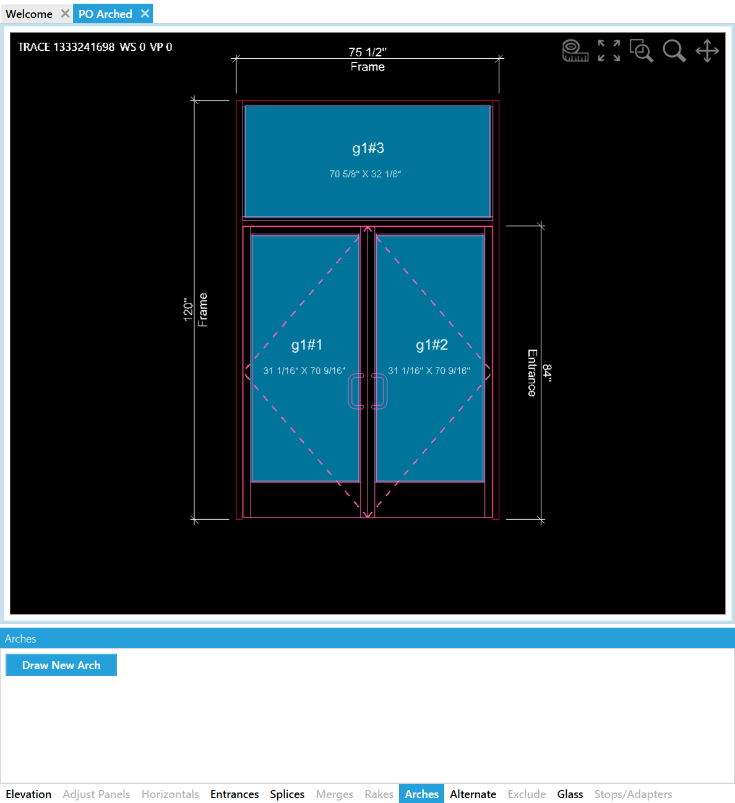
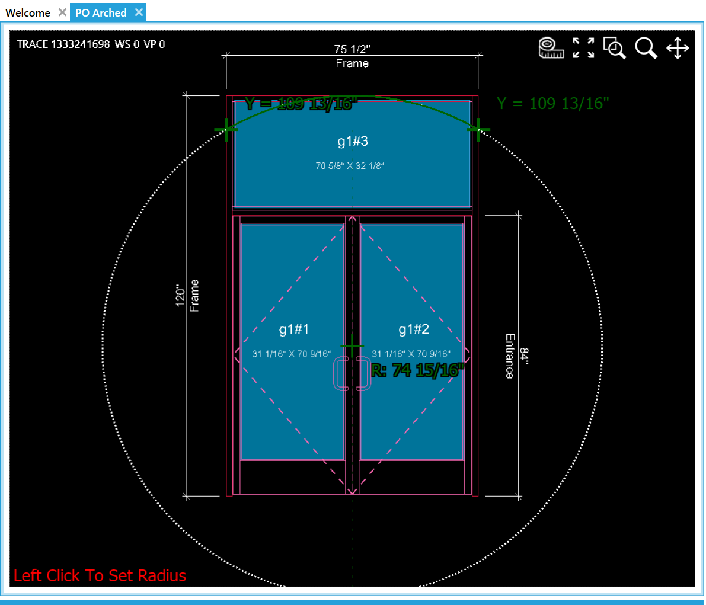
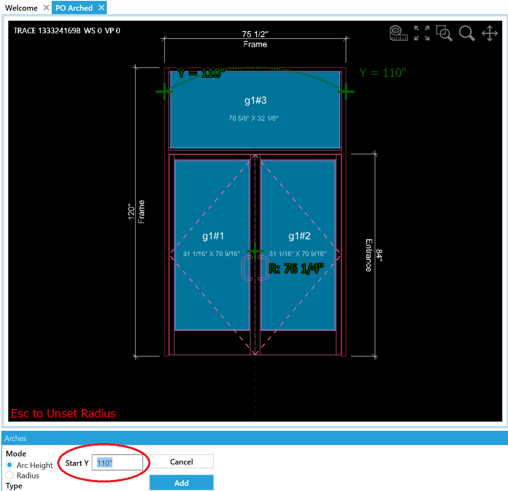
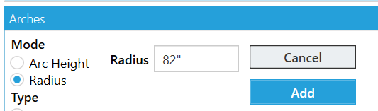
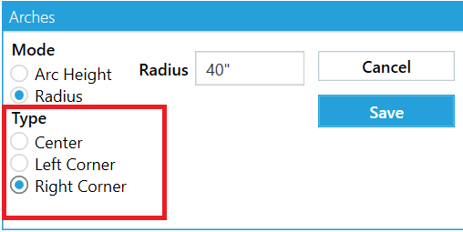
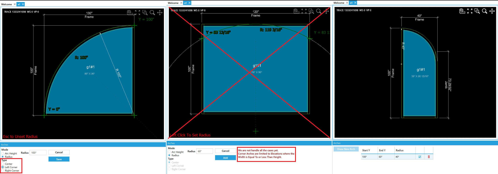
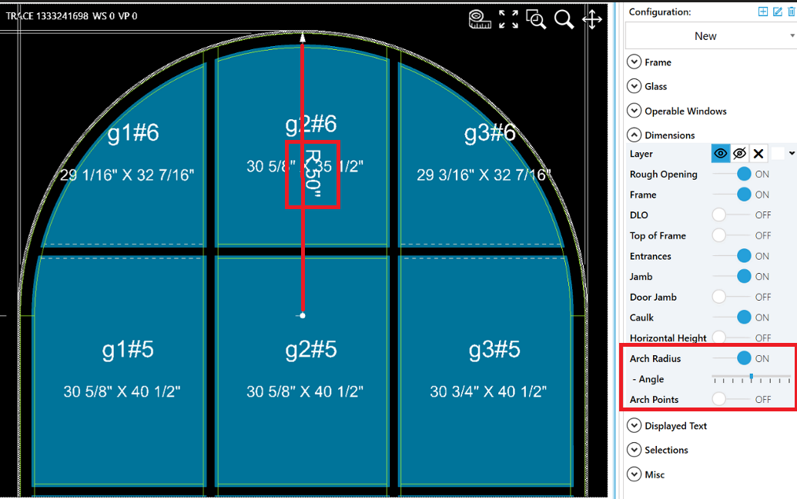
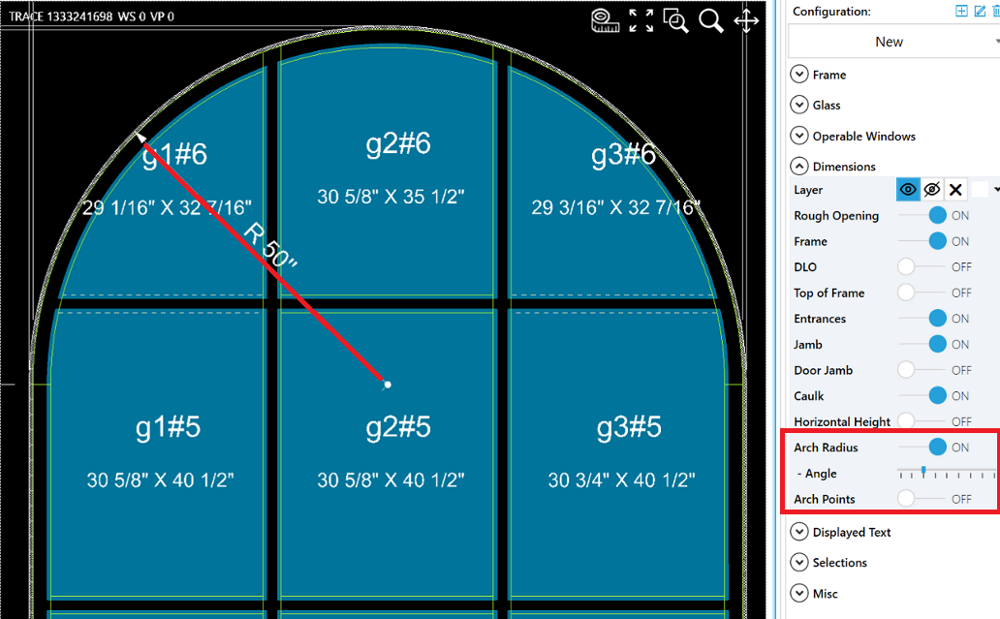

## Locate the Rake Tool Tab
Click ```Draw New Arch``` to activate the arch add mode in the tool tab.


## Choose Your Input Method
There are a couple ways to add the arch.
 - The first way is to place your mouse over the drawing. The mouse position adjusts the **Radius**. When you have the dimensions or are close to the dimension you want click down.



 - The second way building on the previous example to dial in the arch I use the tool bar input. Here you'll see I round out the number. I could have come straight here as well instead of having to click the drawing.




 - The final way which is to switch the input mode to Radius and to use that value if provided.



Click ```Add``` to Complete the Arch

## Corner Arches
We have a way to create corner arches but it is limited to prevent unhandled geometry from crashing the program.
Currently we can only add quarter arches to elevations where the **Elevation Width is Equal To or Less Than the Elevation Height**.


Below to the left and right are valid corner arches and in the middle an elevation with a width > height ratio we currently cannot support.


## Radius Dimension Settings
The visibility, and angle of the arch radius line is customizable in the ```Layer Settings...``` When able the drawing attempts to use the user angle setting, otherwise it uses the closest valid angle.  





<!-- 
:::tip Disabling Snap to Points
If your mouse is snapping to a point and you want to avoid it, hold down the ```CTRL``` key while moving your cursor. This will temporarily disable the snap function, giving you more control over your mouse movements near snap points.
::: -->

