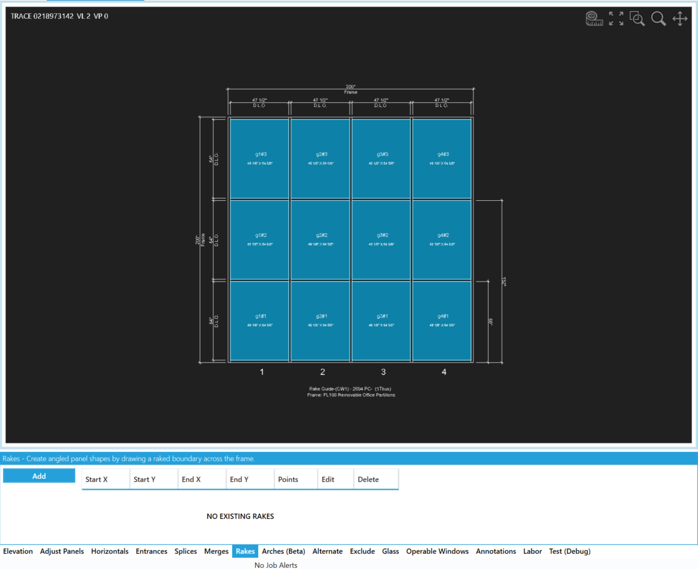
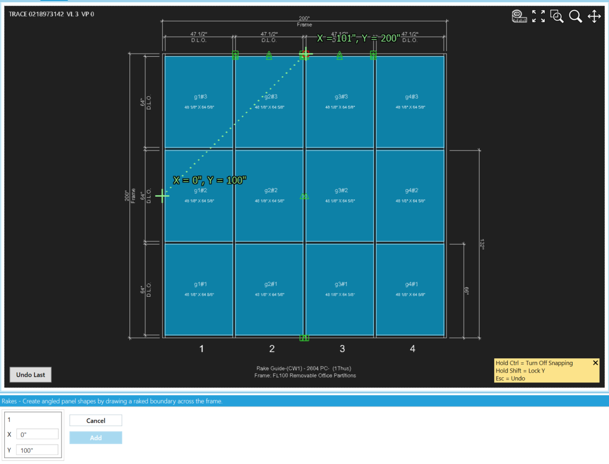
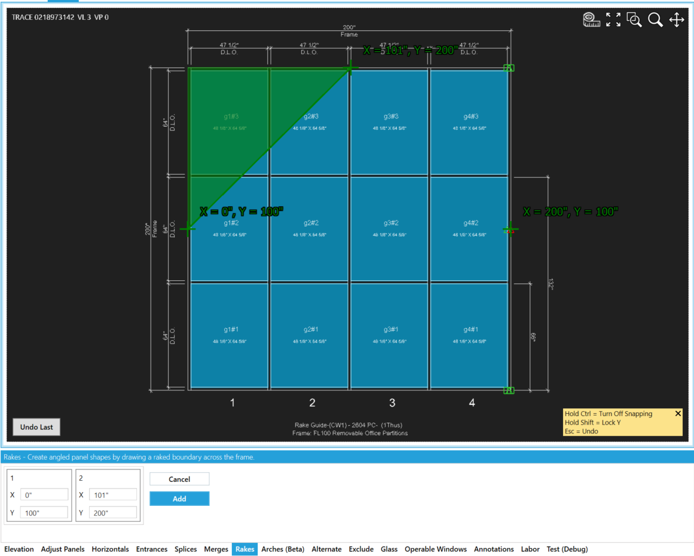
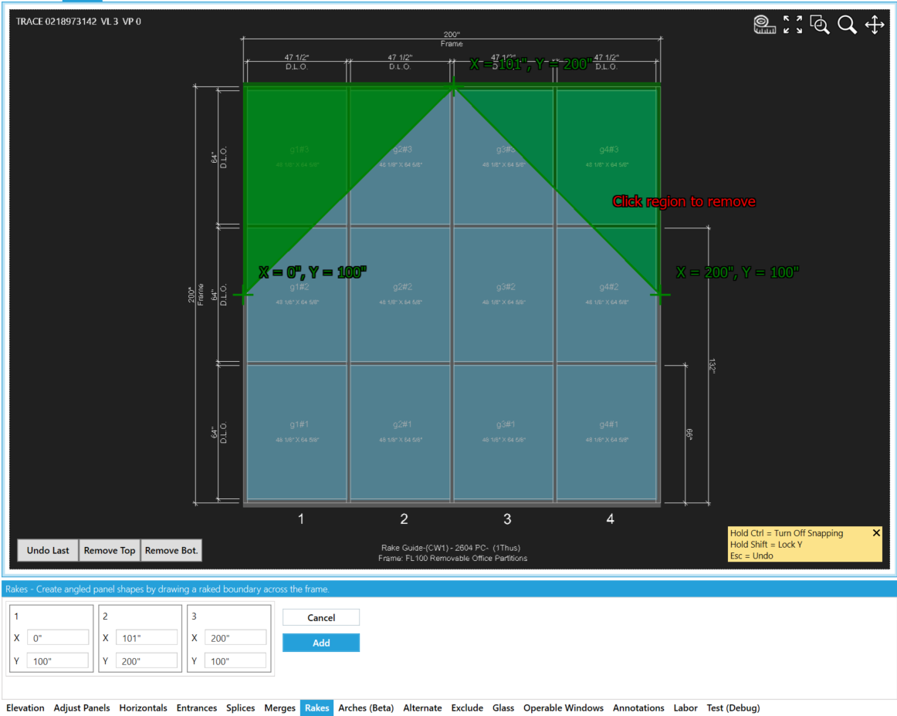
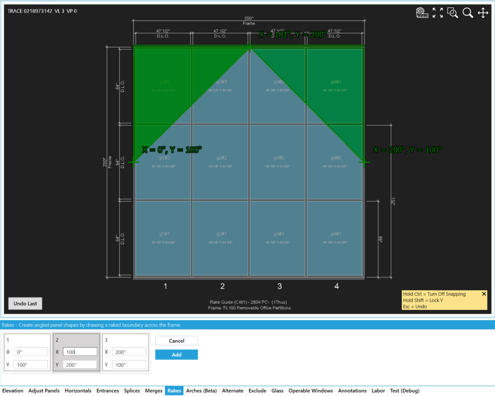
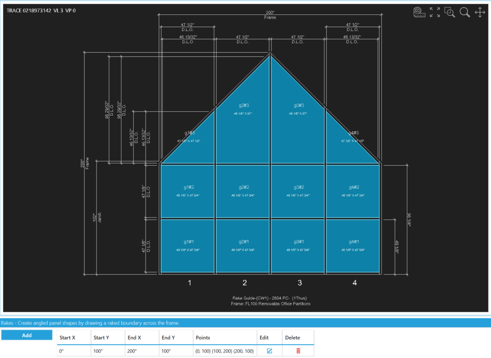
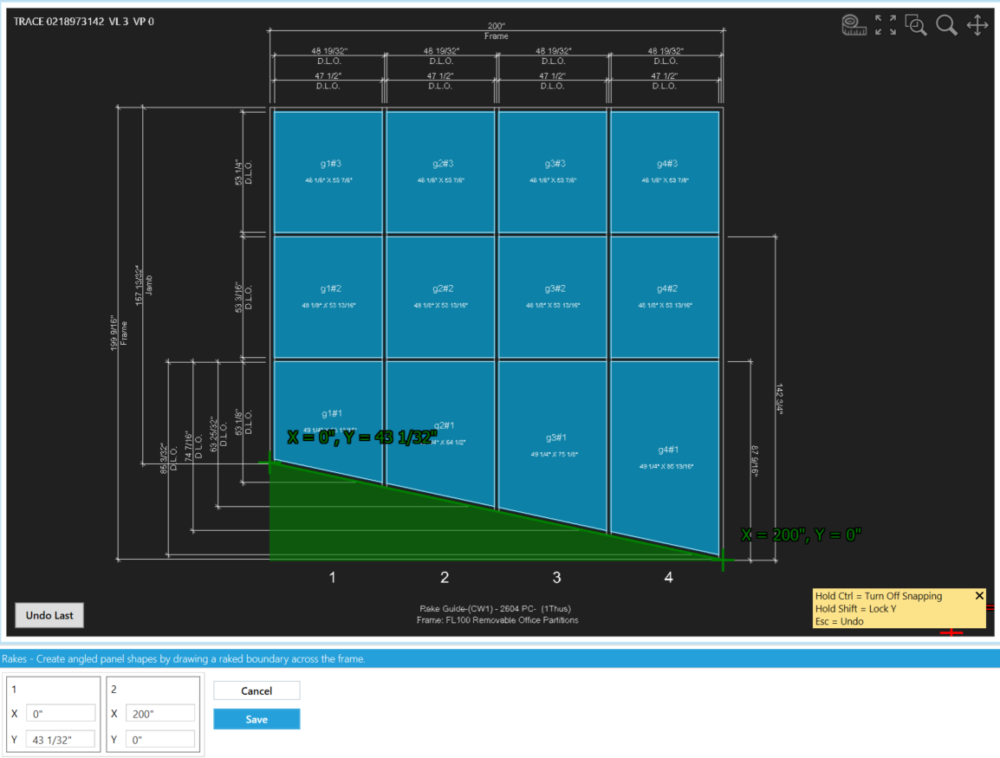
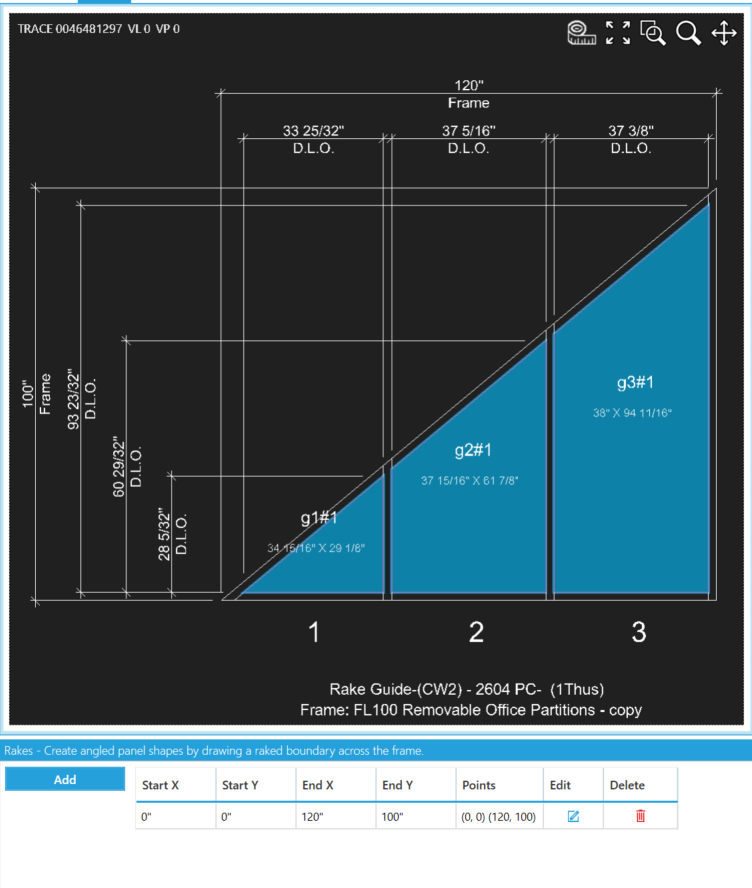

:::danger Dev Note 9/20/2024
    The latest update relaxes validation allowing you to create "Rake Chains". But just because you can draw it with the tooltab does not mean the buisness logic knows how to implement that shape.

    The logic handles top and bottom rakes well but we have yet to fully fleshed out the buisness logic to handle jamb rakes.

    Up vote the slanted verticals feature **[Here](https://feedback.winbidpro.com/suggestions/359068/sloped-side-trapezoids)** so that it moves up in priority.
:::

## Locate the Rake Tool Tab
Click ```Add``` to enter the Rake drawing mode.



## Click the Elevation to Add Points
Validation requires that the first point be on one of the elevation sides. Each point after must have an X value greater or equal to the previous point relative to the direction that the rake is being drawn. In this image I have set my first point at (0, 100) and am preparing to left click to set my second point.

:::tip Disabling Snap to Points
If your mouse is snapping to a point and you want to avoid it, hold down the ```CTRL``` key while moving your cursor. This will temporarily disable the snap function, giving you more control over your mouse movements near snap points.
:::


## Region Automatically Highlighted
The second click helped the drawing behavior to discover that this is most likely a top rake and it is possible to save the rake at this poin, however, I am creating a gabled rake for this sample and will click a third time to generate a thirs point to work with. 



## Select Top or Bottom
Due to the complexity of certain designs, it may be necessary for the user to manually choose whether the top or bottom region of the drawing should be removed when the software cannot confidently determine if a rake applies to the top or bottom. In such cases, you must click on the region you'd like to subtract from the drawing.

:::tip Undo Last
 Clicking ```Undo Last``` button will undo the top/bottom rake decision or remove the last added point. Alternatively, if your active focus is in the drawing area, pressing ```ESC``` will do the same.
:::



## Make Final Adjustments and Save

Instead of trying to perfectly nail the spot that a rake point should go you can throw down points you need in the aproximate location and then manually manipulate the points in their tool tab cards. In the image below I am altering the X of my middle point so that the gable is perfectly centered and then I ```Save```.




## Bottom Slope

Here is a bottom slope example to showing they are now possible



## Rakes to the Floor

These rakes are not yet being able to be fully handled by the buisness logic. If attempting I would reccomend trying it without a head or sill receptors to have the best chance for success.




