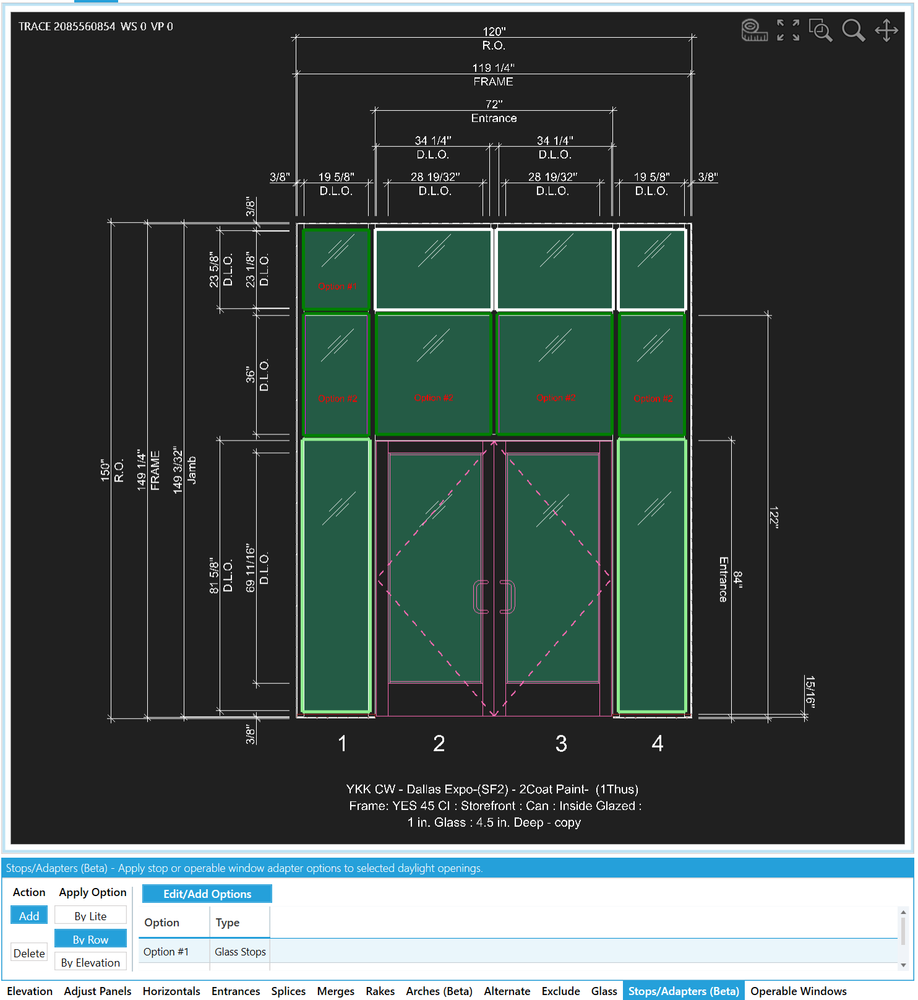

This tool tab lets you add or override stops in selected openings.

In the image below the regular lite position and size text has been disabled with the **Layer Settings**.
The red text displays the option assigned to the opening and for now is only viewable when in this tool tab.

- **Action**
    - **Add** - The default mode where clicking an opening adds the selected option.
    - **Delete** - The inverse mode of add where clicking an assigned opening removes the command.
- **Apply**
    - **By Lite** - Take the selected action on the clicked opening.
    - **By Row** - Take the selected action on all openings with the same starting Y value.
    - **By Elevation** - Take the selected action on all openings.
- **Edit/Add Options** - [Click here](../components/stops-op-win-adapter-options) to learn about how to add/edit options.

:::info
In the future we plan on adding an application mode **By Type** that gets the glass or opwin product that was clicked  and adds commands for each of those similar openings.
:::

<!-- show that op windows adaptors are restricted in application -->
<!-- show the override hierarchy -->

### Stop/Adapter Option Application Hierarchy

Listed in priority

1. Stop/Adapter Commands
2. Door Frame Transom Settings
3. Auto Applied Options

### Operable Window Adapters

Are limited to being added to opening already assigned with an operable window command.