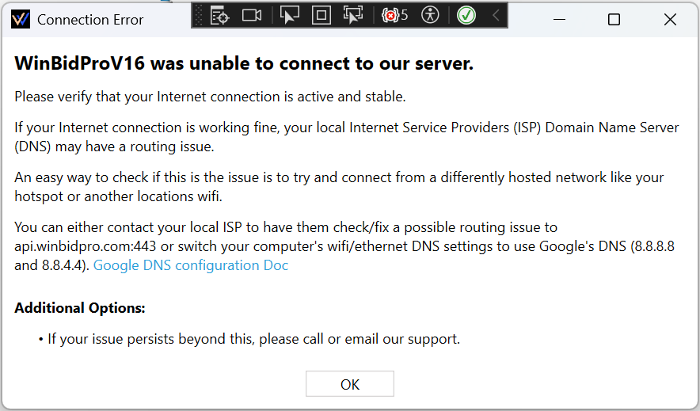
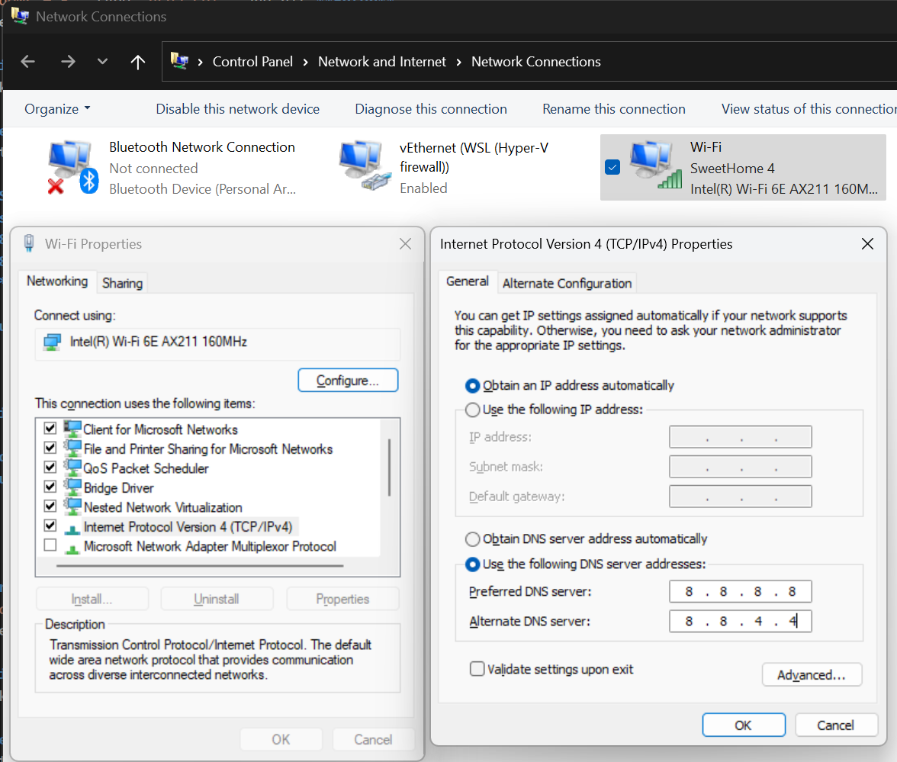

# Switching your DNS

This guide is intended to help you resolve connectivity issues caused by DNS routing problems.
If you are getting this error its possible your local Internet Service Provider (ISP) Domain Name Server (DNS) is having routing issues. One way to resolve that is through calling your ISP but we can manually choose a different DNS through Windows Settings.

## Windows 10/11
1. **Open Network Settings:**
   - Press `Windows + R`, type `ncpa.cpl`, and hit **Enter**.
   - Alternatively, right-click the **Network** icon in the system tray and select **Open Network & Internet settings**. Then click on **Change adapter options**.

2. **Access WiFi Adapter Properties:**
   - Right-click your active WiFi connection and choose **Properties**.

3. **Select Internet Protocol Version 4 (TCP/IPv4):**
   - In the list, click on **Internet Protocol Version 4 (TCP/IPv4)**, then click **Properties**.

4. **Set the DNS Server Addresses:**
   - Select **Use the following DNS server addresses**.
   - Enter **8.8.8.8** for the **Preferred DNS server**.
   - Enter **8.8.4.4** for the **Alternate DNS server**.
   - Click **OK** to save your changes.

5. **Restart Your Connection:**
   - Disconnect and reconnect to your WiFi, or restart your computer to apply the changes.
---

## Troubleshooting & Additional Help

- Bit Defender anti-virus has been known to once in a while raise a false flag on our route ***api.winbidpro.com*** if you have an IT support team they can verify if this is or isn't an issue.
- **Learn more about [Google Public DNS Docs](https://developers.google.com/speed/public-dns/docs/using#windows).**
- **If your issue persists beyond these steps, please call or email our support.**
