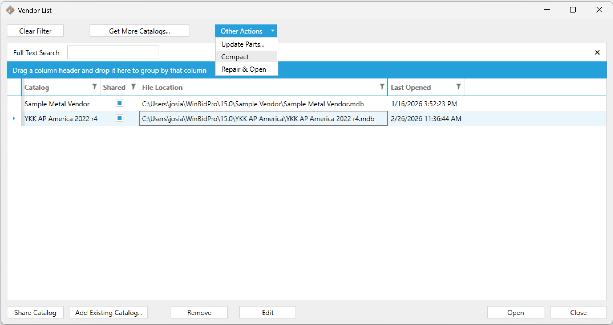
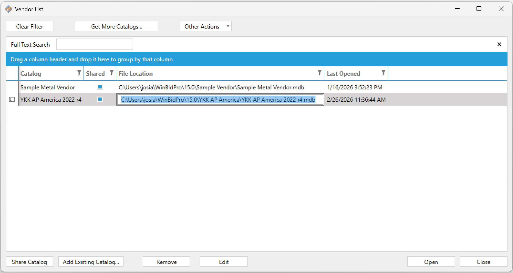
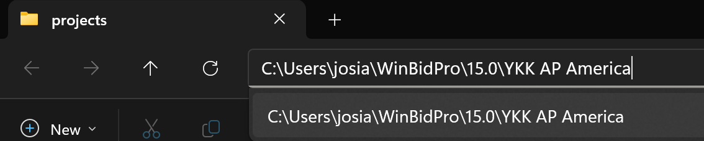
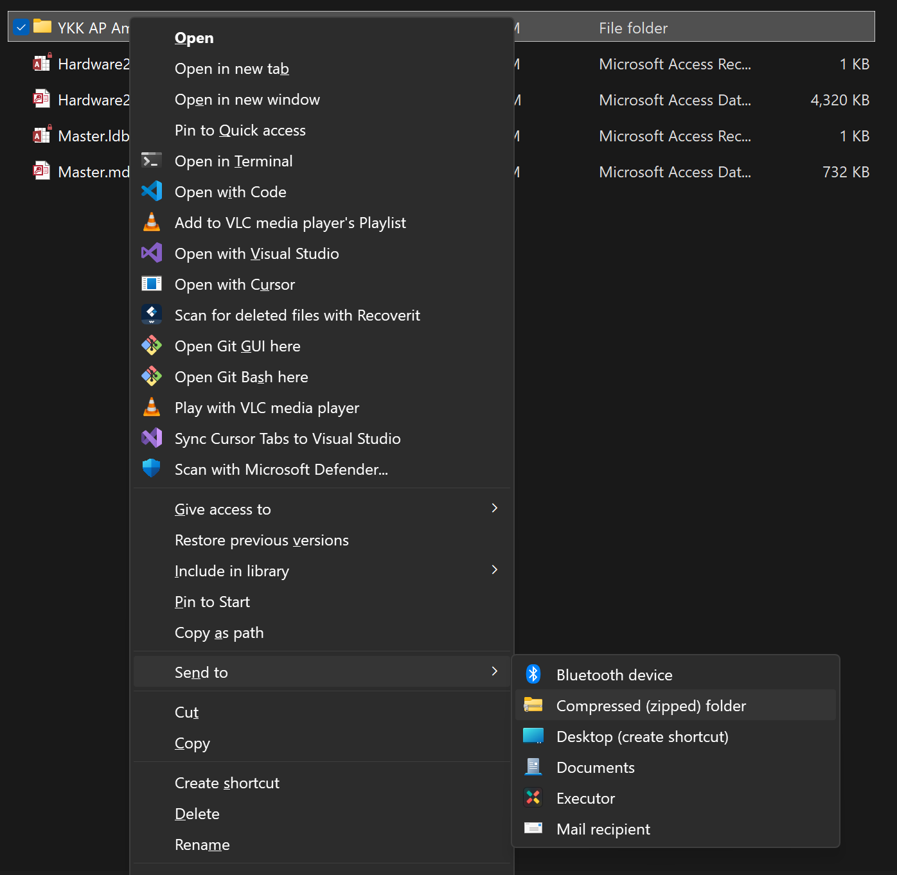

# v15 Catalog Migration Guide

GDS has an internal tool for migrating v15 Vendor Catalogs into v16. This page walks you through how to prepare and send your catalog files so we can import them into your v16 account.

For general information about the v15 to v16 transition, see the [Upgrade FAQ](./upgrading-from-v15.md).

:::warning[Before you begin]

Jobs themselves **cannot** be migrated — only vendor catalogs and framing systems are eligible. Some cleanup or adjustments may be required after migration.

:::

---

## Step 1 — Determine Which Catalogs to Migrate

Before packaging anything, decide which catalogs you want to bring into v16.

Depending on your workflow, catalogs may be shared across users or each estimator may have their own copy. If multiple copies exist, choose the one with the best-quality data — the most current pricing, cleanest framing systems, and most complete parts. That catalog will become the starting point for your team in v16.

:::tip

If you're not sure which copy is the best starting point, [contact us](https://www.gdsestimating.com/support) and we can help you evaluate.

:::

---

## Step 2 — Compact Your Vendor Databases (Optional)

Running **Compact** on each catalog reduces the file size and puts the database in a clean state before you send it. This step is optional but recommended.

1. Open WinBidPro v15 and go to `Catalogs > Manage Vendors`
2. Select the vendor catalog you want to migrate
3. Click **Other Actions** → **Compact**



:::info

If a catalog has become corrupted or won't open, use **Repair & Open** from the same menu before running Compact.

:::

---

## Step 3 — Locate and Zip the Vendor Folder

Each vendor catalog is stored as a `.mdb` database file inside its own folder on your local machine. You need to find that folder, then compress it into a `.zip` file.

### Find the folder path

Open the Vendor List in v15 (`Catalogs > Manage Vendors`). The **File Location** column shows the full path to each catalog file.



The path will look something like:

```
C:\Users\[YourName]\WinBidPro\15.0\YKK AP America\
```

### Navigate to the folder

Copy the folder path (everything up to and including the vendor folder name) and paste it into the Windows Explorer address bar.



### Zip the folder

Go up one level so you can see the vendor folder itself. Right-click it and choose **Send to → Compressed (zipped) folder**.



Repeat this for each catalog you want to migrate.

:::tip[Need help zipping?]

Microsoft has a step-by-step guide: [Zip and unzip files in Windows](https://support.microsoft.com/en-us/windows/zip-and-unzip-files-8d28fa72-f2f9-712f-67df-f80cf89fd4e5).

:::

---

## Step 4 — Share the Zip File with GDS

Upload your zipped vendor folder(s) to a file-sharing platform such as **OneDrive**, **Dropbox**, or **Google Drive**, then share the download link with us at:

> **supoort@gdsestimating.com**

:::info[Follow up]

A follow-up email after sharing the link is appreciated so we can gather your files in a timely manner.

:::

We will notify you once the catalogs have been successfully migrated into your v16 account. If you have any questions during the process, don't hesitate to [reach out](https://www.gdsestimating.com/support).
