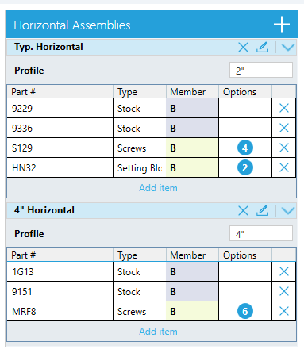
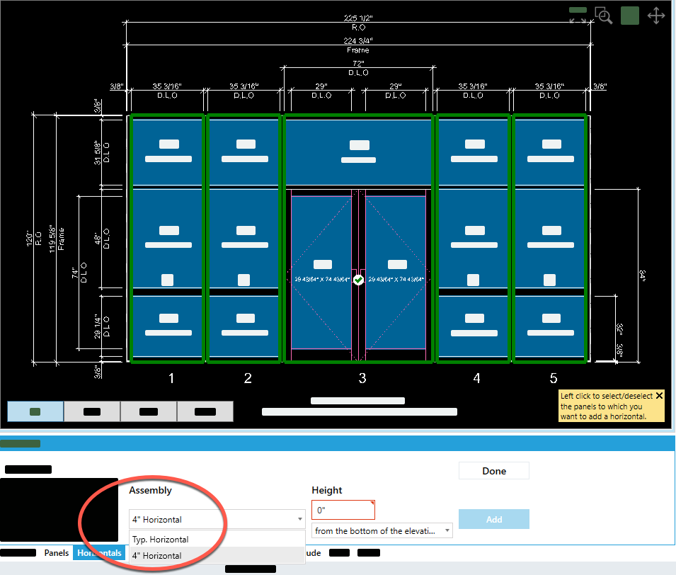
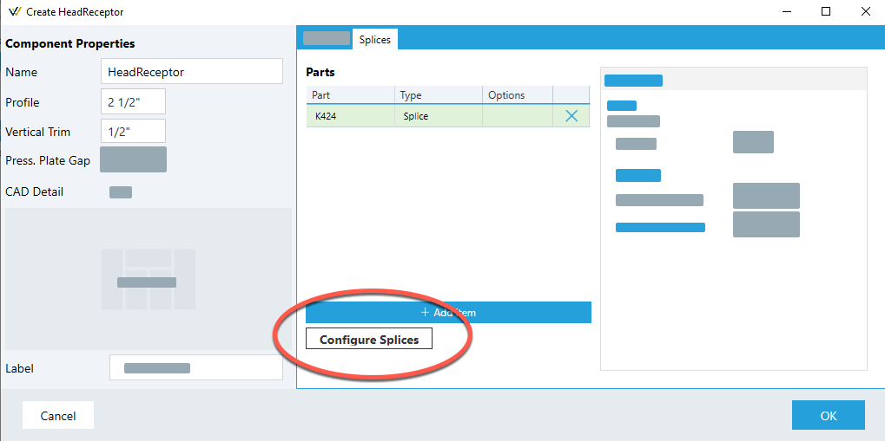
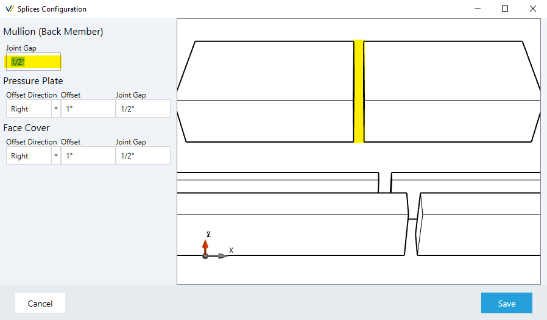

# What's New in WinBidPro v16

For those coming from v15, here is a list of some new and improved features in WinBidPro v16 at its initial launch -- not in any particular order.

## Some of the New v16 Features!
1. **Cloud based data management** - AWS server hosted data for maximum security, performance, and reliability.
2. **Manufacturer Catalogs** - Vendor catalogs are simply selected for use in your company account. These don’t need to be installed or updated. All manufacturer updates to catalog data goes “live” after we update the information on the server.
3. **One Jobs List for All** - Jobs are displayed in one list regardless of the manufacturer, making it much easier to find past quotes.
4. **Welcome Tab** - This shows you recent jobs and give options for creating and opening jobs. It also shows helpful tips and points out new features in the program.
5. **Fully Editable Data** - You can still edit and copy configurations for any catalog in your company account, while the default configurations remain unchanged. This allows manufacturer updates to occur real-time, and prevents these changes from interfering with your own changes.
6. **All New Configuration Windows** - Frame, Door Frame, and Door Leaf configurations now use Assemblies for each given component. This allows multiple assemblies to be saved for any given component (head, sill, jambs, etc.). This gives you an Alternate feature for any component in a drawing.
7. **Improved Interaction with Drawings** - Drawing interface is more interactive than ever. Panels can be clicked when adding entrances. Glass lites can be clicked for merging, and panels clicked for changing width and height – to name a few.
8. **Huge Improvement to Rake/Sloped Top Elevations** - Rake and Gable tops can easily and intuitively be added to any elevation. Rakes can start or end mid panel and start/end points can be edited for precise design and sizing. True "gabled" headers can be easily created.
9. **Improved Glass tab** - Glass types are added to a job before adding them to specific openings. This makes adding glass to different elevations easier and faster, and easily shows what glass is being used in a job.
10. **Improved Feature for Dividing Lites of Glass** - Dividing lites of glass (formerly Splits) is now done with by adding panels to an opening and merging lites above or below. This also applies to dividing transom lites. Doors can now be added to multiple panels to create split transoms.
	* With this method of dividing lites, you can now change panel widths to change division widths of glass.
11. **Central Error Tracking** - Program errors are automatically logged in our server error tracking software, allowing us to prioritize and address issues more efficiently.
12. **Built-in Support Submital Tool** - Users can submit support questions or bugs from within the program.
13. **Built-in Feature Request Tool** - Users can post and vote on suggestions and features for the program. This helps us prioritize improvements and streamline the upgdate process.
14. **Familiar Menu System** - A more modern, familiar menu bar is now used at the top of the program window.
15. **Easy Job Navigation** - A Job Explorer section shows you all elevations for a job in one list and gives you a right-click menu to access quick tasks for both the job and its elevation.
16. **Detachable Tab Windows** - Tabs are created for elevations and the Cut List. Tabs can be detached from the main window and moved to a different part of your screen to see multiple things at once. The Cut List is dynamically updated when elevations are changed, making it easier to verify cut sizes. 
17. **Central Job Messages** - A Job Alerts message is displayed at the bottom of the main window and clicking that will open a tab showing either warnings or problems with a job. Important issues with elevations are displayed in this one place, eliminating the use of annoying popup messages anytime there is a problem.
18. **Newly Designed Markup Report** - A completely new Markup Report has been designed to make markup, tax, and extra charges easier to read and configure.
19. **All New Labor Configrator** - Labor has been completely redesigned to add more flexibility and ease of use. Configurations are no longer dependent on frame types; they can simply be given a name. Configurations can also be easily copied and edited at any time.
20. **New Labor Tab Added** - A Labor tab has also been added to the drawing window to allow easy application and modification of elevation level labor configurations and values. 
21. **New Settings Dock** - We added a Settings Dock that lets you set the visibility and colors for many parts of an elevation drawing. The background, dimensions, the following, and more: 
    * Glass fill patterns can also be assigned to different types of glass.
    * Different colors can be assigned for empty panels and panels with glass.
    * A new Batch Reports window intuitively lets you select multiple reports for viewing, printing, and export.

# Additional Details
## Preconfigure All Alternate Assemblies

In v15, you had to manually enter the extrusion parts of alternate vertical assemblies for each alternate assembly action. There were also a limited number of horizontal assemblies you could configure.

Now in v16, you can configure a framing system with as many vertical and horizontal assemblies as you like, with all parts included. This allows a user to configure various alternate members once, and reuse them as much as they like. You can preconfigure expansion mullions, corner posts, reinforced mullions, and more, and they will be available in the "alternate" command tab.

## Curtain Wall Improvements

v15 was had many short-comings when it came to curtain wall. We've drastically improved the ability to configure curtain wall for accurate cuts of material. We did this this in several ways:

1. Vertical SSG support (horizontal coming soon)
2. Accurate glass sizing with more control over glass bites and SSG joints
3. Accurate pressure plate and face cover cuts
4. Added support for splices with gaps and offsets.

### SSG Support

**Curtain Wall** and **Window Wall** systems have SSG Vertical support. This will help give accurate glass sizes in such systems and accurate pressure plate and face cover cuts. SSG horizontals are not yet supported but support is coming soon.

### Pressure Plate and Face Cover Cuts

Horizontal face cover and pressure plate will account for SSG verticals and run continuous across them. You can also configure gaps at the ends for 100% accurate cuts.

### Horizontal Splices (Pressure plate and cover)

You can now splice horizontal face cover and pressure plate with a preconfigured offset (where applicable). We give you an easy way to select a center point of a vertical or panel in order to specify splice locations. Head and Sill Receptors can also have configured splices with the proper parts and gaps, allowing for more accurate cut lengths and optimization.

### Glass Sizing

Glass sizing is more accurate in Vertical SSG scenarios. You can set glass bites of assemblies to override the system's default to account for special perimeter bite situations. Note: Horizontal SSG is not yet supported but is coming soon.

## Splices

You can configure splices in your systems with gaps and offsets. The drawing commands in the splice command tab will allow splices at any point for verticals, and will snap to center and edge points for horizontal receptors as well as pressure plate and covers. You'll also receive job alerts when cuts are too long and require splices.

## Job Alerts

It can be hard to keep a so many details in your head and be sure that you checked everything. WinBidPro 16 can now help! WinBidPro 16 will perform various checks automatically and alert you to problems, or warn you about potential problems. It does this via the "Job Alerts" view. The kinds of things it can catch are:

* **Misconfigured parts.** In some scenarios we can see when you have entered a part in the wrong component or if the part has some wrong settings
* **Missing system components.** For instance, if you have glass next to an entrance, but there is no pocket filler configured for the door jamb, we'll give you a warning about it.
* **Issues with elevation commands.** For example, if you add an entrance and a later change to the elevation causes a conflict with the entrance.
* **And more!**

Want an alert added for something? Send us suggestions at https://feedback.winbidpro.com/
